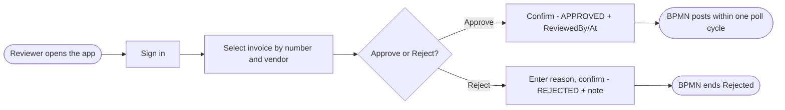

# Solution Design Document — ap-approval-review-carlos

> **Template:** UiPath Coded Apps (Web). React + Vite + Tailwind over the `@uipath/uipath-typescript` SDK.

---

## Document History

| Date | Version | Author | Role | Comments |
|---|---|---|---|---|
| 2026-10-05 | 1.0 | uipath-planner | Generated by AI Agent | Initial SDD generated from `invoice-approval-pdd.md` and its §16 gap analysis |

---

<!-- DO NOT RENAME: uipath-planner detects SDDs via this exact heading or the marker below. -->
<!-- planner-handoff:v1 -->
## Planner Handoff

| Field | Value |
|---|---|
| **Status** | ready |
| **Execution autonomy** | autonomous |
| **Delivery model** | cloud |
| **SDD scope** | solution |
| **Solution root SDD** | invoice-approval-solution-sdd.md |
| **Solution ID** | invoice-approval-solution |
| **Project SDD role** | child |
| **Independently executable** | no — Lane A derives tasks only via the Solution root |
| **Project list section** | §10 Project Structure + §9 Integrated Components |
| **Tasks file** | `implementation-tasks.md` |
| **Generated by** | uipath-planner |
| **Generation date** | 2026-10-05 |
| **Template validation** | passed |

---

## Decisions Made

> Autonomous mode picked the five architectural decisions below without a user checkpoint. Override by rerunning in Interactive mode or by editing the relevant SDD section.

| # | Decision | Picked | One-sentence reason |
|---|---|---|---|
| 1 | **Platform constraints** (Constraint Gate) | cloud; no products blocked | Automation Cloud; Coded Apps available. |
| 2 | **Scope** (Level 1) | Coded App inside Solution `invoice-approval-solution` | Step 5 needs a reviewer worklist with package detail and an audited decision. |
| 3 | **App type** | Web (standalone) | The BPMN polls the record; no Action-app handoff is needed. |
| 4 | **Data access** | Data Fabric by entity name via the TypeScript SDK | The record is the single source of truth (PDD BR-5); no backend to build. |
| 5 | **Decision write** | One `updateRecord` with state + reviewer + timestamp | Atomic, attributable decision (PDD AC-8). |

---

## Recommended Scope

**Recommendation:** SOLUTION(Maestro BPMN, Agents, RPA Process ×2, Coded Functions, Coded App, IXP, Data Fabric) — this file: Coded App `ap-approval-review-carlos`
**Delivery model:** cloud
**Blocked by platform:** none
**Need profile:** Let an AP reviewer decide each waiting invoice from one screen, with the evidence and recommendation in view and the decision recorded for audit.

---

## Action Required — SME Review Items

| # | Section | Item | Question | Default applied | Blocking |
|---|---|---|---|---|---|
| 1 | §6 | Rejection reason field (OQ-6) | Should the reason get its own entity field and a mandatory reason list? | Free-text `reviewerNote` appended to ApprovalPackageJson (as built). | no |
| 2 | §3 | Approve with incomplete evidence (OQ-11) | May the reviewer approve a NEEDS_AP_REVIEW invoice? | Yes, with the incomplete-evidence note shown (as built). | no |
| 3 | §1 | Reviewer access | Which group may open the app in production? | Folder users of `APAutomation_Carlos`. | no |

> These items are marked `[SME REVIEW]` in the document. Default-carried items (Blocking = no) do not block task derivation — the automation is built on the recorded defaults, which must be verified before production sign-off. Any Blocking = yes item keeps the handoff at `Status: draft`.

---

## Table of Contents

1. App Overview
2. App Type & Tech Stack
3. Pages & Routes
4. Components
5. State Management
6. API Integration
7. User Flows
8. Error Handling
9. Integrated Components
10. Project Structure
11. Testing Strategy
12. Next Steps

---

## 1. App Overview

| Field | Value |
|---|---|
| **App name** | `ap-approval-review-carlos` |
| **Objective** | PDD step 5: show approval packages and recommendations; record Approve / Reject with Reviewed By, Reviewed At and a rejection reason. |
| **Primary users** | AP reviewer (acting for the named budget approver) |
| **Trigger** | User navigation to `https://customersuccessamer.staging.uipath.host/ap-approval-review-carlos` |
| **Expected concurrent users** | 1–5 [DEFAULT] |
| **Source PDD** | `invoice-approval-pdd.md` §6 Step 5, §7 Approved?, §14 AC-8 |

### In Scope

- Worklist of invoices with lifecycle state, PO match, approval need and evidence state.
- Detail panel with the approval package, recommendation and missing fields.
- Approve / Reject with confirmation dialog; reason on reject.
- KPI strip and charts over the worklist.

### Out of Scope

- Editing invoice fields or approval inputs.
- Posting (PostToERP) and PO matching.
- Notifications to approvers.

### Assumptions

- Sign-in through UiPath OAuth (PKCE); the signed-in email becomes ReviewedBy.
- VendorTaxId is not shown in the table; amounts are shown to authorised AP users only.
- The BPMN resumes from the record state within one poll cycle.

---

## 2. App Type & Tech Stack

### App Type

- [x] **Web** — standalone web app users navigate to
- [ ] **Action** — triggered by an automation, receives and returns data

### Tech Stack

**Framework:** React 19
**Build tool:** Vite 8
**UI library:** Tailwind CSS 4 (bare utility styling)
**State management:** React hooks + Context (`useAuth`, `useInvoices`, `useDecision`, `useSchema`)

**Justification:** A small single-page worklist with one write action needs no global store. The UiPath TypeScript SDK supplies auth and Data Fabric access, so no backend is required.

---

## 3. Pages & Routes

| Route | Page Name | Purpose | Who Sees It |
|---|---|---|---|
| `/` (unauthenticated) | `GatePage` | Sign-in gate | Everyone |
| `/` (authenticated) | `Worklist` | Invoice table, detail panel, decisions | AP reviewer |

**Decision enablement rule:** Approve and Reject are both enabled only when InvoiceLifecycleState is READY_FOR_APPROVAL or NEEDS_AP_REVIEW **and** ApprovalNeeded is true. On NEEDS_AP_REVIEW the panel shows a one-line note that approval evidence is incomplete, listing MissingApprovalFields.

---

## 4. Components

| Component Name | Type | Used On Pages | Purpose |
|---|---|---|---|
| `InvoiceTable` | TABLE | Worklist | Rows by InvoiceNumber and VendorName (no Record ID column) |
| `InvoiceDetailPanel` | LAYOUT | Worklist | Selected invoice, decision buttons, notes |
| `ApprovalPackageView` | LAYOUT | Worklist | Renders ApprovalPackageJson |
| `ConfirmDialog` | MODAL | Worklist | Confirms the decision; captures reject reason |
| `KpiStrip`, `Charts` | LAYOUT | Worklist | Counts by lifecycle state |
| `StateViews` | LAYOUT | Both | Loading / empty / error states |

---

## 5. State Management

### Global State

| State Slice | Type | Purpose |
|---|---|---|
| auth | USER | Signed-in user and SDK client (`useAuth`) |
| invoices | DATA | Records loaded by entity name (`useInvoices`) |
| schema | DATA | Entity field metadata (`useSchema`) |

### Local Component State

- `InvoiceDetailPanel`: selected row and pending decision.
- `ConfirmDialog`: reason text until submit.

---

## 6. API Integration

| Backend | Type | Purpose | Auth |
|---|---|---|---|
| Data Fabric `AP_Invoice_Carlos` | REST via `@uipath/uipath-typescript` | `getByName`, `getRecordsByName`, `getRecordByName`, `updateRecord({ name }, id, patch)` | OAuth-PKCE; `uipath.json` baseUrl `https://staging.uipath.com` |

**Decision patch:**

| Decision | Fields written |
|---|---|
| Approve | InvoiceLifecycleState = APPROVED, ReviewedBy = signed-in email, ReviewedAt = now (UTC) |
| Reject | InvoiceLifecycleState = REJECTED, ReviewedBy, ReviewedAt, reason appended to ApprovalPackageJson as `reviewerNote` `[SME REVIEW]` item 1 |

### UiPath API Workflow Calls

| API Workflow | Called From | Input | Output |
|---|---|---|---|
| — | — | — | None |

### Integration Service Connections

| Connector | System | Access Method | Used By |
|---|---|---|---|
| — | — | — | None (SDK only) |

---

## 7. User Flows

### Flow: Review an invoice



**Description:** The reviewer finds the invoice by InvoiceNumber and VendorName, reads the package and recommendation, and decides. The app writes one patch to that exact record and refreshes the row from the server response. After a decision, no other record may change to APPROVED/REJECTED.

---

## 8. Error Handling

| Error Scenario | User-Facing Behavior | Logging |
|---|---|---|
| API call fails | Error banner; decision can be retried; row unchanged | Console (no field values) |
| Validation error | Buttons disabled with the reason note (state not reviewable or ApprovalNeeded not true) | NO |
| Session expired | Return to `GatePage`; signed-in email missing blocks the write | YES |
| ApprovalPackageJson unreadable | Decision saved; warning that the reason could not be appended | YES |

---

## 9. Integrated Components

### Called By (if Action app)

| Caller | Type | Context |
|---|---|---|
| — | — | Not an Action app. The BPMN reads the decision from the record through `POMatch_Carlos_get_invoice_status`. |

### HITL Form Role

- [ ] This app is a HITL form renderer (called from `uipath-human-in-the-loop` touchpoints)
- [x] This app is standalone

---

## 10. Project Structure

```text
lab6-coded-app/ap-approval-review-Carlos/
├── .uipath/            (git-ignored)
├── uipath.json         (baseUrl https://staging.uipath.com)
├── src/
│   ├── screens/        GatePage.tsx, Worklist.tsx
│   ├── components/     InvoiceTable, InvoiceDetailPanel, ApprovalPackageView, ConfirmDialog, KpiStrip, Charts, StateViews
│   ├── data/           fields, model, useInvoices, useDecision, useSchema, approvalPackage, errors
│   ├── hooks/          useAuth.tsx
│   └── config/         app.ts
├── package.json
└── dist/               (build output — required before pack)
```

### Deployment Target

- [ ] Development workspace (default — the specialist's own authoring/publish surface)
- [x] Orchestrator (for production) — `uip codedapp pack dist` → `publish -t Web` → `deploy --folder-key <APAutomation_Carlos key>`; bump the version on every change

### Solution / Project Breakdown

| Project | Product (RPA / API / Agent / …) | GitHub Repository | Folder | Attended / Unattended |
|---|---|---|---|---|
| `ap-approval-review-carlos` | Coded App (Web) | `UiPath-Coders/commercial_bootcamp_Carlos` (`lab6-coded-app/`) | `Agentic Bootcamp/APAutomation_Carlos` | Attended (human user) |

### Reusable Components

| Type (reused / new-reusable) | Name | Details |
|---|---|---|
| reused | `ap-approval-review-carlos` 1.0.1 | Deployed; URL returns HTTP 200; no decision processed yet (PDD §16 step 5 partial) |

### Environments (DEV / UAT / PROD)

| Item | DEV | UAT | PROD | Used By |
|---|---|---|---|---|
| Orchestrator + Tenant/Service | staging.uipath.com / Training | [SME REVIEW] | [SME REVIEW] | This app |
| Folder | `Agentic Bootcamp/APAutomation_Carlos` | [SME REVIEW] | [SME REVIEW] | This app |

### Non-Functional Requirements

| Dimension | Requirement / Design decision |
|---|---|
| **Security** | OAuth-PKCE; no secrets in the bundle; VendorTaxId not displayed in the table; decision attributable to the signed-in user. |
| **Performance** | One records query per refresh; patch response merged locally. |
| **Scalability** | Static hosting; stateless client. |
| **Availability / Resilience** | Retry on failed decision; no partial writes (single patch). |
| **Logging & Monitoring** | Errors to console without field values. |
| **Compliance** | ReviewedBy / ReviewedAt audit trail (PDD AC-8). |

---

## 11. Testing Strategy

### Canonical Test Cases

| Test ID | User Flow | Input | Expected Outcome |
|---|---|---|---|
| T-01 | Review | Approve a READY_FOR_APPROVAL invoice (state InvoiceNumber + VendorName first) | APPROVED; ReviewedBy/At set; no other record changed |
| T-02 | Review | Reject with a reason | REJECTED; reviewerNote in package |
| T-03 | Review | NEEDS_AP_REVIEW invoice | Buttons enabled; incomplete-evidence note lists missing fields |
| T-04 | Review | AUTO_APPROVED / HOLD_PO_MISMATCH / POSTED invoice | Buttons disabled with reason |
| T-05 | Review | ApprovalNeeded false with NEEDS_AP_REVIEW | Buttons disabled; rerun-agent note |
| T-06 | Session | Expired session during decision | Gate page; no write |

### Unit Tests

- Component rendering
- State management logic (decision enablement rule)
- API error handling

### E2E Tests

- Playwright against the deployed URL: sign in, approve T-01, verify the record via `uip df records query` (selected fields exclude VendorTaxId and ApprovalPackageJson), and confirm the BPMN instance resumes.

---

## 12. Next Steps

Load `uipath-planner` with the Solution root:

> Load `uipath-planner`. SDD path: `invoice-approval-solution-sdd.md`.

Lane A writes the shared `implementation-tasks.md`; tasks for this app route to `uipath-coded-apps` (first reviewer decision, optional reason field), ordered before the BPMN end-to-end test.

Implementation tasks **do not live in this SDD** — they live in the planner's output.

---

**End of Solution Design Document.**
