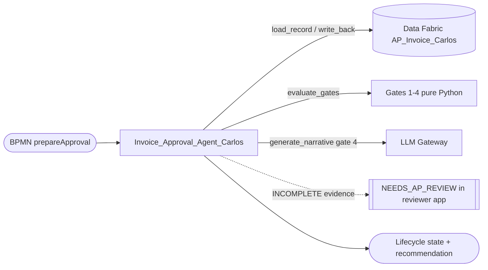

# Solution Design Document — Invoice_Approval_Agent_Carlos

> **Template:** UiPath Agents. Coded agent (Python, LangGraph).

---

## Document History

| Date | Version | Author | Role | Comments |
|---|---|---|---|---|
| 2026-10-05 | 1.0 | uipath-planner | Generated by AI Agent | Initial SDD generated from `invoice-approval-pdd.md` and its §16 gap analysis |

---

<!-- DO NOT RENAME: uipath-planner detects SDDs via this exact heading or the marker below. -->
<!-- planner-handoff:v1 -->
## Planner Handoff

| Field | Value |
|---|---|
| **Status** | ready |
| **Execution autonomy** | autonomous |
| **Delivery model** | cloud |
| **SDD scope** | solution |
| **Solution root SDD** | invoice-approval-solution-sdd.md |
| **Solution ID** | invoice-approval-solution |
| **Project SDD role** | child |
| **Independently executable** | no — Lane A derives tasks only via the Solution root |
| **Project list section** | §9 Project Structure |
| **Tasks file** | `implementation-tasks.md` |
| **Generated by** | uipath-planner |
| **Generation date** | 2026-10-05 |
| **Template validation** | passed |

---

## Decisions Made

> Autonomous mode picked the five architectural decisions below without a user checkpoint. Override by rerunning in Interactive mode or by editing the relevant SDD section.

| # | Decision | Picked | One-sentence reason |
|---|---|---|---|
| 1 | **Platform constraints** (Constraint Gate) | cloud; no products blocked | Automation Cloud; coded agents and LLM Gateway available. |
| 2 | **Scope** (Level 1) | Coded agent inside Solution `invoice-approval-solution` | Step 4 needs evidence assembly plus a written recommendation (judgment). |
| 3 | **Framework** | LangGraph | Explicit node graph: load → retry guard → gates → narrative → write back. |
| 4 | **Determinism split** | Gates are pure Python; LLM writes only the narrative | Lifecycle outcomes must be auditable and rule-based; only gate 4 calls the LLM. |
| 5 | **LLM failure mode** | Template narrative fallback | The package is still produced when the LLM is unavailable. |

---

## Recommended Scope

**Recommendation:** SOLUTION(Maestro BPMN, Agents, RPA Process ×2, Coded Functions, Coded App, IXP, Data Fabric) — this file: coded Agent `Invoice_Approval_Agent_Carlos`
**Delivery model:** cloud
**Blocked by platform:** none
**Need profile:** Give the reviewer a complete, consistent approval package with a recommendation, and flag missing evidence instead of sending incomplete packages.

---

## Action Required — SME Review Items

| # | Section | Item | Question | Default applied | Blocking |
|---|---|---|---|---|---|
| 1 | §3 | Required evidence | Which approval inputs are mandatory for a complete package? | GLAccount, CostCenter, Approver, ReceiptReference (as built); PaymentTerms, VendorRiskScore, InvoiceLineSummary optional. | no |
| 2 | §5 | Narrative quality bar | Who signs off on recommendation wording? | LLM-judge criteria in §5; AP lead review in UAT. | no |

> These items are marked `[SME REVIEW]` in the document. Default-carried items (Blocking = no) do not block task derivation — the automation is built on the recorded defaults, which must be verified before production sign-off. Any Blocking = yes item keeps the handoff at `Status: draft`.

---

## Table of Contents

1. Agent Overview
2. Agent Framework
3. Tools
4. Memory / RAG
5. Evaluation Criteria
6. Orchestrator Bindings
7. Error Handling & Escalation
8. Integrated Components
9. Project Structure
10. Testing Strategy
11. Next Steps

---

## 1. Agent Overview

| Field | Value |
|---|---|
| **Agent name** | `Invoice_Approval_Agent_Carlos` |
| **Role** | Approval Package Agent |
| **Objective** | PDD step 4: evaluate the four gates on one record, build the approval package, write a recommendation and the evidence state back to the record. |
| **Trigger** | Orchestrator StartJob from the BPMN `prepareApproval` task (processType Agent), input `recordId`. |
| **Expected LLM model** | `gpt-4.1-mini-2025-04-14` via UiPath LLM Gateway (override env `AP_INVOICE_LLM_MODEL`), temperature 0 |
| **Expected volume** | One run per approval-needed invoice `[SME REVIEW]` volume not stated |
| **Source PDD** | `invoice-approval-pdd.md` §6 Step 4, §9, §10 EX-7 |

### In Scope

- Read the record (excluding VendorTaxId from graph state).
- Retry guard: never re-prepare or downgrade APPROVED, REJECTED, POSTED.
- Four deterministic gates (table in §3).
- LLM narrative (summary, risk flags) for gate 4 only; template fallback.
- Write ApprovalEvidenceState, MissingApprovalFields, AgentRecommendation, ApprovalPackageJson, AgentProcessedAt, InvoiceLifecycleState.

### Out of Scope

- The approve/reject decision (reviewer app).
- PO matching (functions) and posting (PostToERP).

### Assumptions

- POMatched and ApprovalNeeded are already set by `POMatch_Carlos_process_invoice`.
- The entity has the 27 user fields (ApprovalPackageJson is MULTILINE_TEXT; timestamps DATETIME_WITH_TZ).
- Governance policy fetch 403 in job logs is expected noise.

---

## 2. Agent Framework

**Selected framework:** LangGraph

| Framework | Best For | Chosen? |
|---|---|---|
| Simple Function | Single-turn Q&A, no tool chaining | NO |
| LangGraph | Complex multi-step reasoning, state machines | YES |
| LlamaIndex | RAG-heavy agents, document search | NO |
| OpenAI Agents | OpenAI-native tool calling | NO |

**Justification:** The agent is a small state machine with conditional edges (finish early on missing record, on a protected state, or on gates 1–3). LangGraph makes each node and branch explicit and traceable, while keeping the LLM confined to one node.

---

## 3. Tools

| Tool Name | Tool Type | Repo / IS URL | Purpose | Input Schema | Output Schema |
|---|---|---|---|---|---|
| `load_record` | PYTHON_FN (Data Fabric SDK) | `lab5-coded-agent/agent/Invoice_Approval_Agent_Carlos/data_fabric.py` | Read the record by Id | `recordId` (GUID string) | record dict without VendorTaxId |
| `evaluate_gates` | PYTHON_FN (pure) | `approval_gates.py` | Gates 1–4 | record dict | `GateResult` (evidence state, missing fields, recommendation, lifecycle state, fired gate) |
| `generate_narrative` | PYTHON_FN (LLM Gateway) | `narrative.py` | Summary and risk flags for gate 4 | non-confidential facts | `{summary, risk_flags, source, model}` |
| `write_back` | PYTHON_FN (Data Fabric SDK) | `data_fabric.py` | Update the six agent fields + lifecycle | record Id, outputs | updated Id |

**Gates** (evaluated in order; first match wins):

| # | Condition | ApprovalEvidenceState | Recommendation / InvoiceLifecycleState | LLM call |
|---|---|---|---|---|
| 1 | POMatched false | NOT_EVALUATED | HOLD_PO_MISMATCH | no |
| 2 | ApprovalNeeded explicitly false | NOT_REQUIRED | AUTO_APPROVED | no |
| 3 | A required approval input is empty | INCOMPLETE (+ MissingApprovalFields) | NEEDS_AP_REVIEW | no |
| 4 | Otherwise | COMPLETE | READY_FOR_APPROVAL | yes |

### Tool Invocation Policy

- `load_record`: always first; finish with errorType when not found.
- Retry guard: finish with `wasAlreadyPrepared = true` when the record is in a protected state or already prepared.
- `evaluate_gates`: always after the guard.
- `generate_narrative`: only when gate 4 fires; on any LLM error use the template narrative.
- `write_back`: once per run, after gates (and narrative when applicable).

### Agent Configuration

| Field | Value |
|---|---|
| **Agent type** | FUNCTIONAL |
| **Primary function** | Record Id → approval package and recommendation on the record |
| **Agent hosting** | CLOUD (staging.uipath.com, Training tenant) |
| **Arguments — in** | `recordId` (string, GUID) |
| **Arguments — out** | `recordId`, `approvalEvidenceState`, `missingApprovalFields`, `recommendation`, `invoiceLifecycleState`, `errorType`, `errorMessage` (string); `wasAlreadyPrepared` (boolean) |

### Agent Interaction Diagram



---

## 4. Memory / RAG

### Short-term Memory

- [x] Required
- [ ] Not required

**Purpose:** WITHIN_SESSION_CONTEXT — LangGraph state for one run (no VendorTaxId).

### Long-term Memory

- [ ] Required (via UiPath memory service or external store)
- [x] Not required

**Purpose:** NONE — the record is the durable state.

### RAG Sources

| Source Name | Type | Description | Indexing Strategy |
|---|---|---|---|
| — | — | Not required | — |

---

## 5. Evaluation Criteria

### Success Metrics

| Metric | Target | Measurement |
|---|---|---|
| Gate correctness | 100% expected lifecycle state on the eval set | `uip codedagent eval` with `smoke-test.json` + json-similarity evaluator |
| LLM calls | Exactly 1 on gate 4; 0 on gates 1–3 and protected states | Trace spans (`uip traces spans get <TraceId>`) |
| Package completeness | 100% of approval-needed records get a package and recommendation (PDD AC-7) | Record query |

### Trajectory Evaluation

| Test Case | Expected Tool Sequence | Acceptable Variations |
|---|---|---|
| Gate 4 (complete evidence) | load_record → evaluate_gates → generate_narrative → write_back | template narrative if LLM fails |
| Gates 1–3 | load_record → evaluate_gates → write_back | none |
| Protected state | load_record → finish | none |

### LLM-Judge Criteria

| Criterion | Description | Pass Threshold |
|---|---|---|
| Grounded | Narrative cites only facts in the record | 100% |
| No confidential values | No tax ID; no amounts beyond the record's own fields shown to AP | 100% |
| Actionable | States the recommendation and any risk flags | ≥ 0.8 judge score |

---

## 6. Orchestrator Bindings

| Binding Name | Resource Type | Purpose |
|---|---|---|
| `AP_Invoice_Carlos` | Data Fabric entity (tenant) | Read/write the record |
| LLM Gateway | Connection (platform) | Narrative model |
| `Invoice_Approval_Agent_Carlos` | PROCESS | Created with `uip or processes create` in `APAutomation_Carlos` |

---

## 7. Error Handling & Escalation

### Agent-level errors

| Error Scenario | Handling |
|---|---|
| Tool invocation fails | RETURN_ERROR — errorType + sanitized errorMessage (≤ 300 chars); record not downgraded. |
| LLM refuses or returns invalid output | Template narrative (`source: template`, reason recorded); run continues. |
| Rate limit hit | Template narrative fallback; no retry storm. |

### HITL Escalation

| Scenario | Escalation Type | Who Resolves |
|---|---|---|
| Missing approval evidence (gate 3) | Record state NEEDS_AP_REVIEW, shown in the reviewer app with the missing fields | AP reviewer |
| Complete evidence (gate 4) | READY_FOR_APPROVAL in the reviewer app | AP reviewer on behalf of the named approver |

**Note:** Escalation is state-based: the BPMN waits on the record and the reviewer app records the decision. No Action Center task is created.

---

## 8. Integrated Components

### RPA Processes Called as Tools

| Process Name | Tool Name | Purpose |
|---|---|---|
| — | — | None |

### API Workflows Called as Tools

| API Workflow Name | Tool Name | Purpose |
|---|---|---|
| — | — | None |

### Integration Service Connectors

| Connector | Tool Name | Operation |
|---|---|---|
| — | — | None |

### Integration Service Connections

| Connector | System | Access Method | Used By |
|---|---|---|---|
| UiPath LLM Gateway | LLM | Platform SDK (`UiPathAzureChatOpenAI`) | `generate_narrative` |
| Data Fabric | AP_Invoice_Carlos | UiPath Python SDK | `load_record`, `write_back` |

---

## 9. Project Structure

### Implementation Mode

- [x] **Coded Agent** (Python) — recommended for complex logic, custom frameworks
- [ ] **Low-code Agent** (agent.json via Agent Builder) — recommended for simple agents

### Coded Agent Structure

```text
lab5-coded-agent/agent/Invoice_Approval_Agent_Carlos/
├── pyproject.toml
├── langgraph.json
├── entry-points.json
├── bindings.json
├── uipath.json
├── main.py               # graph: load_record → retry_guard → evaluate_gates → write_narrative → write_back → finish
├── approval_gates.py     # pure gates and retry guard
├── narrative.py          # LLM narrative + template fallback
├── data_fabric.py        # record read/write
├── config.py
├── evaluations/
│   ├── eval-sets/smoke-test.json
│   └── evaluators/json-similarity.json
└── tests/
```

### Low-code Agent Structure

Not used — this is a coded agent.

### Solution / Project Breakdown

| Project | Product (RPA / API / Agent / …) | GitHub Repository | Folder | Attended / Unattended |
|---|---|---|---|---|
| `Invoice_Approval_Agent_Carlos` | Agent (coded, LangGraph) | `UiPath-Coders/commercial_bootcamp_Carlos` (`lab5-coded-agent/`) | `Agentic Bootcamp/APAutomation_Carlos` | N-A (serverless) |

### Reusable Components

| Type (reused / new-reusable) | Name | Details |
|---|---|---|
| reused | `Invoice_Approval_Agent_Carlos` 0.0.1 | Deployed; 3 successful jobs; 8 records prepared |
| reused | `approval_gates.py` | Pure, unit-tested gate logic |

### Environments (DEV / UAT / PROD)

| Item | DEV | UAT | PROD | Used By |
|---|---|---|---|---|
| Orchestrator + Tenant/Service | staging.uipath.com / Training | [SME REVIEW] | [SME REVIEW] | All |
| Folder | `Agentic Bootcamp/APAutomation_Carlos` | [SME REVIEW] | [SME REVIEW] | This agent |

### Non-Functional Requirements

| Dimension | Requirement / Design decision |
|---|---|
| **Security** | VendorTaxId never enters graph state (`uip codedagent run` prints state after every node); no amounts in logs; LLM receives only non-confidential facts. |
| **Performance** | LLM only on gate 4, temperature 0, max 600 tokens. |
| **Scalability** | Serverless; one run per record. |
| **Availability / Resilience** | Retry guard makes re-runs safe; template fallback on LLM failure. |
| **Logging & Monitoring** | Traces per run; gate trace in the package. |
| **Compliance** | Auditable gate trace and AgentProcessedAt. |

---

## 10. Testing Strategy

### Canonical Test Case

| Input | Expected Output |
|---|---|
| `recordId` of an untouched record with POMatched true, ApprovalNeeded true, all required inputs present | `READY_FOR_APPROVAL`, evidence COMPLETE, one LLM call, package written |

### Evaluation Dataset

| Test ID | Input | Expected Trajectory | LLM-Judge Criteria |
|---|---|---|---|
| T-01 | Record, gate 4 | load → gates → narrative → write | Grounded, actionable |
| T-02 | Record with POMatched false | load → gates → write | HOLD_PO_MISMATCH, no LLM |
| T-03 | Record with ApprovalNeeded false | load → gates → write | AUTO_APPROVED, no LLM |
| T-04 | Record missing GLAccount and ReceiptReference | load → gates → write | NEEDS_AP_REVIEW; MissingApprovalFields lists both |
| T-05 | APPROVED / REJECTED / POSTED record | load → finish | wasAlreadyPrepared; no write |
| T-06 | Already-prepared gate-4 record | load → finish | No second LLM call (trace proof) |
| T-07 | Unknown recordId | load → finish | errorType set |
| T-08 | LLM unavailable | load → gates → narrative (template) → write | source = template |

### Regression Strategy

- Run evaluation dataset on every code change
- Track pass rate over time
- Any drop below 100% on T-02 to T-07 blocks deployment

---

## 11. Next Steps

Load `uipath-planner` with the Solution root:

> Load `uipath-planner`. SDD path: `invoice-approval-solution-sdd.md`.

Lane A writes the shared `implementation-tasks.md`; tasks for this agent route to `uipath-agents` (eval re-run, redeploy if changed), ordered after `POMatch_Carlos` and before the BPMN.

Implementation tasks **do not live in this SDD** — they live in the planner's output.

---

**End of Solution Design Document.**
