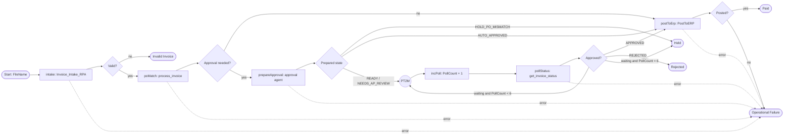

# Solution Design Document — InvoiceApprovalProcess_Carlos

> **Template:** Maestro BPMN. Hosts the Coded Functions `POMatch_Carlos` (no separate SDD for the functions).

---

## Document History

| Date | Version | Author | Role | Comments |
|---|---|---|---|---|
| 2026-10-05 | 1.0 | uipath-planner | Generated by AI Agent | Initial SDD generated from `invoice-approval-pdd.md` and its §16 gap analysis |

---

<!-- DO NOT RENAME: uipath-planner detects SDDs via this exact heading or the marker below. -->
<!-- planner-handoff:v1 -->
## Planner Handoff

| Field | Value |
|---|---|
| **Status** | ready |
| **Execution autonomy** | autonomous |
| **Delivery model** | cloud |
| **SDD scope** | solution |
| **Solution root SDD** | invoice-approval-solution-sdd.md |
| **Solution ID** | invoice-approval-solution |
| **Project SDD role** | child |
| **Independently executable** | no — Lane A derives tasks only via the Solution root |
| **Project list section** | §4 Activities Inventory + §9 Integrated Components |
| **Tasks file** | `implementation-tasks.md` |
| **Generated by** | uipath-planner |
| **Generation date** | 2026-10-05 |
| **Template validation** | passed |

---

## Decisions Made

> Autonomous mode picked the five architectural decisions below without a user checkpoint. Override by rerunning in Interactive mode or by editing the relevant SDD section.

| # | Decision | Picked | One-sentence reason |
|---|---|---|---|
| 1 | **Platform constraints** (Constraint Gate) | cloud; no products blocked | Automation Cloud; Maestro BPMN and Solutions available. |
| 2 | **Scope** (Level 1) | Maestro BPMN inside Solution `InvoiceApprovalSolution_Carlos` | Three gateways, a timer-driven human wait and five ends across six products. |
| 3 | **Engine** (Pass A.5) | BPMN over Flow / Case | Explicit gateways, boundary errors and a timer loop are native BPMN constructs. |
| 4 | **Human wait** | Timer loop PT2M polling the record, max 6 polls, then Held | The reviewer app writes the record; no userTask needed; polling cost bounded. |
| 5 | **Component invocation** | `Orchestrator.StartJob` with literal release keys for every RPA, agent and function | The only runnable form for agents and functions in this tenant (Lab 10 runtime rules). |

---

## Recommended Scope

**Recommendation:** SOLUTION(Maestro BPMN, Agents, RPA Process ×2, Coded Functions, Coded App, IXP, Data Fabric) — this file: Maestro BPMN `InvoiceApprovalProcess_Carlos` + Coded Functions `POMatch_Carlos`
**Delivery model:** cloud
**Blocked by platform:** none
**Need profile:** Run each invoice from arrival to Paid (or a clear Rejected / Held end) without anyone moving it between systems.

---

## Action Required — SME Review Items

| # | Section | Item | Question | Default applied | Blocking |
|---|---|---|---|---|---|
| 1 | §11 | Production trigger | Should instances start automatically on bucket upload / email arrival? | Manual / API start with `FileName` per invoice. | no |
| 2 | §6 | Review timeout (OQ-5) | Wait limit and escalation contact? | 6 polls × PT2M (about 13 minutes), then end Held. | no |
| 3 | §5 | Approve unmatched (OQ-4) | Route HOLD_PO_MISMATCH to the reviewer? | No — end Held. | no |
| 4 | §5 | Vendor return (OQ-1) | Notify the vendor on Invalid Invoice? | No notification; end Invalid Invoice. | no |
| 5 | §10 | ERP retry (OQ-7) | Retry an unreachable ERP before failing? | No automatic retry; Operational Failure end; AP re-runs. | no |

> These items are marked `[SME REVIEW]` in the document. Default-carried items (Blocking = no) do not block task derivation — the automation is built on the recorded defaults, which must be verified before production sign-off. Any Blocking = yes item keeps the handoff at `Status: draft`.

---

## Table of Contents

1. Process Overview
2. Process Diagram
3. Pools & Lanes
4. Activities Inventory
5. Gateways & Sequence Flows
6. Events
7. Data Objects & Variables
8. Subprocesses & Call Activities
9. Integrated Components
10. Error Handling & Retry
11. Triggers
12. Project Structure
13. Testing Strategy
14. Next Steps

---

## 1. Process Overview

| Field | Value |
|---|---|
| **Process name** | `InvoiceApprovalProcess_Carlos` (solution `InvoiceApprovalSolution_Carlos`) |
| **Objective** | Execute PDD steps 1–6 and the three decisions for one invoice file, calling the existing Lab 2–6 components. |
| **Department / Function** | Finance — Accounts Payable |
| **Trigger type** | MANUAL (API / CLI run with `FileName`) |
| **Expected execution volume** | One instance per invoice `[SME REVIEW]` daily volume |
| **Long-running characteristic** | Typical: a few minutes (auto-approved) / Max: about 13 minutes of review wait, then Held |
| **Source PDD** | `invoice-approval-pdd.md` §6–§10, §16 (end-to-end orchestration: target-state only) |

### In Scope

- Orchestrate intake, PO match, approval preparation, review wait, posting.
- Route the three gateways to five ends: Invalid Invoice, Rejected, Paid, Held, Operational Failure.
- Error boundary on every service task.

### Out of Scope

- Rebuilding any Lab 2–6 component.
- The reviewer UI (coded app) and the payment run after submission.

### Assumptions

- All five Lab processes exist once in `Agentic Bootcamp/APAutomation_Carlos` and are linked, not copied, at deploy.
- `POMatch_Carlos_process_invoice` carries the process env var `ERP_PO_LOOKUP_URL` (Maestro cannot pass job env vars).
- The coded agent's processType is Agent and it accepts `recordId`.

---

## 2. Process Diagram



---

## 3. Pools & Lanes

| Pool | Lane | Role / Participant | Owns Activities (node keys) | Notes |
|---|---|---|---|---|
| Invoice Approval | Automation | Maestro + robots/agents | `intake`, `poMatch`, `prepareApproval`, `incPoll`, `pollStatus`, `postToErp`, all gateways | Serverless jobs |
| Invoice Approval | AP Review | AP reviewer (for the budget approver) | — (decision made in `ap-approval-review-carlos`; observed via `pollStatus`) | No userTask |
| ERP | External | ERP / AP portal | — | Reached by `poMatch` (API) and `postToErp` (UI) |

---

## 4. Activities Inventory

| # | Node Key | BPMN Element Type | Description | Inputs | Outputs | Integrated Component | Notes |
|---|---|---|---|---|---|---|---|
| 1 | `start` | startEvent | Instance per invoice file | `FileName` | — | — | Trigger type: MANUAL |
| 2 | `intake` | serviceTask | Steps 1–2: extract, Valid?, create record | `FileName`, `CreateQueueItem`=false | `VarRecordId`, `VarIsValid`, `VarWasDuplicate` | RPA `Invoice_Intake_RPA_Carlos` | StartJob, literal releaseKey, inputs `type="string"` |
| 3 | `gwValid` | exclusiveGateway | Valid? | `VarIsValid` | — | — | |
| 4 | `poMatch` | serviceTask | Step 3: PO match + approval rule; writes POMatched/ApprovalNeeded | `record_id` = `VarRecordId` | `VarPoMatched`, `VarApprovalRequired`, `VarMatchReason` | Function `POMatch_Carlos_process_invoice` | Per-argument output mapping |
| 5 | `gwApproval` | exclusiveGateway | Approval needed? | `VarApprovalRequired` | — | — | |
| 6 | `prepareApproval` | serviceTask | Step 4: gates, package, recommendation | `recordId` = `VarRecordId` | `VarLifecycleState`, `VarEvidenceState` | Agent `Invoice_Approval_Agent_Carlos` | StartJob with the agent release key |
| 7 | `gwPrepared` | exclusiveGateway | Route on the prepared state | `VarLifecycleState` | — | — | |
| 8 | `timerWait` | intermediateCatchEvent | Wait for the reviewer | — | — | — | Timer PT2M |
| 9 | `incPoll` | task (BPMN.Variables) | `PollCount + 1` | `PollCount` | `PollCount` | — | `custom="true"` output, `source="=js:…"` |
| 10 | `pollStatus` | serviceTask | Read the decision | `record_id` | `VarLifecycleState`, `VarPostedToErp` | Function `POMatch_Carlos_get_invoice_status` | |
| 11 | `gwApproved` | exclusiveGateway | Approved? / keep waiting | `VarLifecycleState`, `PollCount` | — | — | |
| 12 | `postToErp` | serviceTask | Step 6: post and close | `RecordId`, `ApprovalConfirmed`, `PortalUrl` | `VarPosted`, `VarPostingId`, `VarWasAlreadyPosted` | RPA `PostToERP_Carlos` | ApprovalConfirmed true only from the APPROVED branch |
| 13 | `gwPosted` | exclusiveGateway | Posted or already posted? | `VarPosted`, `VarWasAlreadyPosted` | — | — | |
| 14 | `endInvalid` | endEvent | Rejected — structurally incomplete | — | — | — | |
| 15 | `endRejected` | endEvent | Rejected — reviewer decision | — | — | — | |
| 16 | `endPaid` | endEvent | Paid (record POSTED) | — | — | — | |
| 17 | `endHeld` | endEvent | Held (PO mismatch or review timeout) | — | — | — | |
| 18 | `endFailure` | endEvent | Operational Failure | — | — | — | Reached from every error boundary |

---

## 5. Gateways & Sequence Flows

### Gateways

| Gateway Key | Type | Incoming | Outgoing | Default Flow | Purpose |
|---|---|---|---|---|---|
| `gwValid` | exclusive | `intake` | `poMatch`, `endInvalid` | `endInvalid` | PDD Valid? |
| `gwApproval` | exclusive | `poMatch` | `prepareApproval`, `postToErp` | `prepareApproval` | PDD Approval needed? |
| `gwPrepared` | exclusive | `prepareApproval` | `endHeld`, `postToErp`, `timerWait` | `endHeld` | Route on agent result |
| `gwApproved` | exclusive | `pollStatus` | `postToErp`, `endRejected`, `timerWait`, `endHeld` | `endHeld` | PDD Approved? + timeout |
| `gwPosted` | exclusive | `postToErp` | `endPaid`, `endFailure` | `endFailure` | Posting confirmed |

### Sequence Flows

| Flow Key | Source | Target | Condition Expression | Notes |
|---|---|---|---|---|
| `fValidYes` | `gwValid` | `poMatch` | `VarIsValid == true` | |
| `fValidNo` | `gwValid` | `endInvalid` | default | |
| `fApprovalNo` | `gwApproval` | `postToErp` | `VarApprovalRequired == false` | ApprovalConfirmed = false |
| `fApprovalYes` | `gwApproval` | `prepareApproval` | default | |
| `fHold` | `gwPrepared` | `endHeld` | `VarLifecycleState == "HOLD_PO_MISMATCH"` (default) | `[SME REVIEW]` item 3 |
| `fAuto` | `gwPrepared` | `postToErp` | `VarLifecycleState == "AUTO_APPROVED"` | |
| `fWait` | `gwPrepared` | `timerWait` | state ∈ {READY_FOR_APPROVAL, NEEDS_AP_REVIEW} | PollCount starts at 0 |
| `fApproved` | `gwApproved` | `postToErp` | `VarLifecycleState == "APPROVED"` | ApprovalConfirmed = true |
| `fRejected` | `gwApproved` | `endRejected` | `VarLifecycleState == "REJECTED"` | |
| `fKeepWaiting` | `gwApproved` | `timerWait` | state ∈ {READY_FOR_APPROVAL, NEEDS_AP_REVIEW} AND `PollCount < 6` | |
| `fTimeout` | `gwApproved` | `endHeld` | default | |
| `fPosted` | `gwPosted` | `endPaid` | `VarPosted == true OR VarWasAlreadyPosted == true` | |
| `fNotPosted` | `gwPosted` | `endFailure` | default | |

---

## 6. Events

| Event Key | Event Kind | Definition | Attached To (boundary) | Interrupting? | Timer / Message / Error detail |
|---|---|---|---|---|---|
| `start` | start | none | — | — | Inputs: `FileName` (string) |
| `timerWait` | intermediate-catch | timer | — | — | `PT2M` (never faster; each cycle starts a serverless job) |
| `errIntake` | boundary | error | `intake` | yes | Any job failure → `endFailure` |
| `errPoMatch` | boundary | error | `poMatch` | yes | Includes ERP_UNREACHABLE |
| `errPrepare` | boundary | error | `prepareApproval` | yes | |
| `errPoll` | boundary | error | `pollStatus` | yes | |
| `errPost` | boundary | error | `postToErp` | yes | |
| `endInvalid`, `endRejected`, `endPaid`, `endHeld`, `endFailure` | end | none | — | — | Five named ends |

---

## 7. Data Objects & Variables

Variable ids have no underscores (underscores are stripped at runtime).

| Name | Direction | Type | Scope | Default | Description |
|---|---|---|---|---|---|
| `FileName` | IN | string | process | — | File in `InvoiceInbox_Carlos` |
| `VarRecordId` | — | string | process | "" | Data Fabric record Id |
| `VarIsValid` | — | boolean | process | false | Intake Valid? result |
| `VarWasDuplicate` | — | boolean | process | false | Existing record reused |
| `VarPoMatched` | — | boolean | process | false | From `po_matched` |
| `VarApprovalRequired` | — | boolean | process | true | From `approval_required` |
| `VarMatchReason` | — | string | process | "" | MATCHED / PO_NOT_FOUND / VENDOR_INACTIVE / OUTSIDE_TOLERANCE |
| `VarLifecycleState` | — | string | process | "" | Agent / poll result |
| `VarEvidenceState` | — | string | process | "" | Agent result |
| `PollCount` | — | integer | process | 0 | Review poll counter, max 6 |
| `VarPostedToErp` | — | boolean | process | false | From poll |
| `VarPosted` | OUT | boolean | process | false | Posting result |
| `VarWasAlreadyPosted` | OUT | boolean | process | false | Idempotent posting |
| `VarPostingId` | OUT | string | process | "" | Portal confirmation id |
| `PortalUrl` | — | string | process | `https://commercial-bootcamp-mock-erp.onrender.com/portal/` | Hosted portal |

No confidential values (tax ID, amounts) are held in process variables.

---

## 8. Subprocesses & Call Activities

### Subprocesses

| Subprocess Key | Kind | Nested Scope Summary | Scoped Variables | Multi-instance? |
|---|---|---|---|---|
| — | — | None; the review loop is modelled with a timer event and gateway | — | no |

### Call Activities

| Call Activity Key | Invokes | Target Process | Input / Output Mapping |
|---|---|---|---|
| — | — | None; agents are started as jobs with StartJob, not call activities | — |

---

## 9. Integrated Components

### RPA Processes Invoked

| Process Name | Called From Node | Purpose |
|---|---|---|
| `Invoice_Intake_RPA_Carlos` | `intake` | Steps 1–2 (see `invoice-intake-rpa-sdd.md`) |
| `PostToERP_Carlos` | `postToErp` | Step 6 (see `post-to-erp-sdd.md`) |

### Agents Invoked

| Agent Name | Called From Node | Purpose |
|---|---|---|
| `Invoice_Approval_Agent_Carlos` | `prepareApproval` | Step 4 (see `invoice-approval-agent-sdd.md`) |
| `Invoice_Extraction_Agent_Carlos` | — (called by `intake`, not by the BPMN) | Step 1 (see `invoice-extraction-agent-sdd.md`) |

### API Workflows Invoked

| API Workflow Name | Called From Node | Purpose |
|---|---|---|
| — | — | None |

### Integration Service Connectors

| Connector | Called From Node | Operation |
|---|---|---|
| — | — | None |

### Integration Service Connections

| Connector | System | Access Method | Used By |
|---|---|---|---|
| ERP PO lookup | ERP | Direct HTTP (signed URL in env var `ERP_PO_LOOKUP_URL`) | `poMatch` via `POMatch_Carlos_process_invoice` |

### Coded Functions

`POMatch_Carlos` 0.0.2 — Python (`uip function`), four entry points, one Orchestrator process each, each bound to its own entry point. First line of `main.py` sets httpx logging to WARNING so the signed URL is never logged.

| Function | Called From Node | Input → Output (typed) | Purpose / Dependencies |
|---|---|---|---|
| `POMatch_Carlos_process_invoice` | `poMatch` | `{record_id: str, entity_name?: str}` → `{record_id, po_matched: bool, approval_required: bool, open_amount: decimal, match_reason: str, error_type, error_message}` | Reads the record, calls `po_lookup`, writes POMatched + ApprovalNeeded. Needs process env var `ERP_PO_LOOKUP_URL`. |
| `POMatch_Carlos_get_invoice_status` | `pollStatus` | `{record_id: str}` → `{record_id, invoice_lifecycle_state: str, approval_needed: bool (unset → true), posted_to_erp: bool (unset → false), reviewed_by, reviewed_at, found: bool, error_type, error_message}` | Review poll; read-only. |
| `POMatch_Carlos_po_lookup` | — (internal / test) | `POLookupInput{vendor_name, po_number, invoice_total: decimal, currency}` → `{po_matched, approval_required, open_amount, match_reason, error_type, error_message}` | Pure rule: PO exists AND vendor active AND `abs(total − open) ≤ 2% × open`; approval = not matched OR total > 10,000 USD. |
| `POMatch_Carlos_process_invoice_queue` | — (batch path) | `{queue_name, folder_path, entity_name, max_items}` → `{processed, matched, approval_required, failed, errors}` | Drains `InvoiceQueue_Carlos`; completes every transaction (empty 200/204 handled), never leaves one In Progress. Needs `ERP_PO_LOOKUP_URL`. |

Match reasons: `MATCHED`, `PO_NOT_FOUND`, `VENDOR_INACTIVE`, `OUTSIDE_TOLERANCE`. The 2% tolerance applies in both directions (as built; PDD OQ-10).

### HITL Touchpoints

| Node Key | HITL Type | Purpose | Approval Criteria |
|---|---|---|---|
| — (`timerWait` / `pollStatus` loop) | External app (no userTask) | Wait for the AP reviewer decision in `ap-approval-review-carlos` | AP reviewer, on behalf of the named approver, approves or rejects READY_FOR_APPROVAL / NEEDS_AP_REVIEW invoices |

---

## 10. Error Handling & Retry

| Scope | Mechanism | Trigger | Retry Policy | Action |
|---|---|---|---|---|
| Process-level | Unhandled exception | Any activity fails | — | End Operational Failure |
| Activity-level | Boundary error event on each serviceTask | Job Faulted / error output | 0 automatic retries `[SME REVIEW]` item 5 | `endFailure`; re-run the instance (components are idempotent) |
| Activity-level | Function `error_type` (e.g. ERP_UNREACHABLE) | Non-empty error_type | 0 | Treated as failure → `endFailure` |
| Activity-level | Review timeout | `PollCount` = 6 | — | `endHeld` |
| Activity-level | Posting not confirmed | `VarPosted` false and not already posted | 0 | `endFailure`; record stays unposted |

A failed instance's Maestro job can still show Successful; judge outcome by element executions and the end event reached.

---

## 11. Triggers

| Trigger Type | Configuration | Notes |
|---|---|---|
| MANUAL | `uip maestro bpmn process run "<ProcessKey>:<version>" <solution-folder-key> --release-key <key> --feed-id <feed> --inputs '{"FileName":"<file>"}'` | Returns the JobKey = instance id. Production auto-trigger `[SME REVIEW]` item 1. |

---

## 12. Project Structure

```text
lab10-maestro-bpmn/InvoiceApprovalSolution_Carlos/
├── InvoiceApprovalSolution_Carlos.uipx          (committed)
└── InvoiceApprovalProcess_Carlos/
    ├── InvoiceApprovalProcess_Carlos.bpmn
    ├── project.uiproj
    ├── entry-points.json                       (FileName input — written by hand, then refresh)
    └── bindings_v2.json                        (v2.2, name + folderPath per process — written by hand)
```

Coded Functions source: `lab3-api/POMatch_Carlos/` (`main.py`, `uipath.json` functions map, `pyproject.toml`, `tests/`).

### Orchestrator Deployment Target

- [ ] Development workspace (default — the specialist's own authoring/publish surface)
- [x] Orchestrator (`.uipx`-wrapped solution → `uipath-solution`; standalone package → `uipath-maestro-bpmn` packages, uploads, and deploys itself via `uip maestro bpmn`)

### Solution / Project Breakdown

| Project | Product (RPA / API / Agent / …) | GitHub Repository | Folder | Attended / Unattended |
|---|---|---|---|---|
| `InvoiceApprovalProcess_Carlos` | Maestro BPMN | `UiPath-Coders/commercial_bootcamp_Carlos` (`lab10-maestro-bpmn/`) | New child folder of `Agentic Bootcamp/APAutomation_Carlos` (created by solution deploy) | N-A |
| `POMatch_Carlos` | Coded Functions (Python) | same repo (`lab3-api/`) | `Agentic Bootcamp/APAutomation_Carlos` | N-A (serverless) |

### Reusable Components

| Type (reused / new-reusable) | Name | Details |
|---|---|---|
| reused | `POMatch_Carlos` 0.0.2 | Four processes; 7 successful jobs |
| reused | Lab 2–6 processes | Linked by `uip solution deploy config link`, never copied |
| new-reusable | `InvoiceApprovalProcess_Carlos` | End-to-end process; reference shape in `lab10-maestro-bpmn/reference/` |

### Environments (DEV / UAT / PROD)

| Item | DEV | UAT | PROD | Used By |
|---|---|---|---|---|
| Orchestrator + Tenant/Service | staging.uipath.com / Training | [SME REVIEW] | [SME REVIEW] | All |
| Folder | `Agentic Bootcamp/APAutomation_Carlos` (+ solution child folder) | [SME REVIEW] | [SME REVIEW] | All |

### Non-Functional Requirements

| Dimension | Requirement / Design decision |
|---|---|
| **Security** | The signed ERP URL stays in the process env var; before debug and pack, grep `resources/` for `access_token` / `environmentVariables` and clear them; after pack, grep the zip (nested nupkgs included) for `access_token=`. No confidential values in variables. |
| **Performance** | PT2M poll; one serverless job per poll. |
| **Scalability** | Independent instances per invoice. |
| **Availability / Resilience** | Error boundary on every service task; idempotent components make re-runs safe. |
| **Logging & Monitoring** | `uip maestro bpmn instance element-executions` and `instance variables` (Data.Globals) for live state. |
| **Compliance** | Every end state is recorded on the record or the instance. |

---

## 13. Testing Strategy

### Canonical Test Case

| Input Variable | Value |
|---|---|
| `FileName` | An invoice file in `InvoiceInbox_Carlos` whose record is already POSTED (debug runs only) |

### Happy Path Assertions

1. Auto-approved invoice: intake → Valid → poMatch → postToErp → Paid; one RecordId; record POSTED; agent and app not involved.
2. Reviewer invoice: waits in the timer loop; after approval in the app, resumes within one cycle and ends Paid with the same record POSTED.

### Gateway / Branch Coverage

| Gateway Key | Path | Setup | Expected Route |
|---|---|---|---|
| `gwValid` | no | File missing PO number or total | `endInvalid` |
| `gwValid` | yes | Valid file | `poMatch` |
| `gwApproval` | no | Matched, total ≤ threshold | `postToErp` → `endPaid` |
| `gwApproval` | yes | Total > threshold or not matched | `prepareApproval` |
| `gwPrepared` | HOLD_PO_MISMATCH | PO not matched | `endHeld` |
| `gwPrepared` | wait | Complete or incomplete evidence | `timerWait` |
| `gwApproved` | APPROVED | Reviewer approves | `postToErp` → `endPaid` |
| `gwApproved` | REJECTED | Reviewer rejects | `endRejected` |
| `gwApproved` | timeout | No decision | `endHeld` after PollCount 6 |
| `gwPosted` | already posted | Re-run of a POSTED record | `endPaid` |

### Boundary-Event & Timeout Scenarios

| Event Key | Setup | Expected Behavior |
|---|---|---|
| `errPoMatch` | Process env var missing on `process_invoice` (test copy) | ERP_UNREACHABLE → `endFailure`; record not matched |
| `errPost` | Portal unreachable | `endFailure`; record unposted |
| `timerWait` | Leave the record waiting | 6 polls (about 13 minutes) → `endHeld` |

### Error Path Scenarios

| Scenario | Setup | Expected Process Behavior |
|---|---|---|
| Intake job faults | File not in bucket | `endFailure` |
| Agent faults | Invalid recordId | `endFailure`; record unchanged |
| Duplicate file | Same file twice | Second instance reuses the record and ends Paid via WasAlreadyPosted |

### End-to-End Orchestration Test

1. Debug with `uip maestro bpmn debug` on a file whose record is already POSTED; list the Studio Web debug solutions for cleanup.
2. Run the auto-approved file reserved for Lab 10 (007) after deploy; confirm Paid and POSTED.
3. Run the reviewer file reserved for Lab 10 (009); approve VA-INV-40592 (Vertex Analytics Corp.) in the app — not TRAIN-VA-1006 — and confirm Paid.
4. Confirm `APAutomation_Carlos` still holds exactly one copy of each Lab 2–5 process; grep packs and resources for `access_token=` (0 hits).

---

## 14. Next Steps

Load `uipath-planner` with the Solution root:

> Load `uipath-planner`. SDD path: `invoice-approval-solution-sdd.md`.

Lane A writes the shared `implementation-tasks.md`; tasks route to `uipath-functions` (verify bindings and env vars), `uipath-maestro-bpmn` (author, validate, debug), and `uipath-solution` (pack, publish, link, deploy), ordered after every component it calls.

Implementation tasks **do not live in this SDD** — they live in the planner's output.

---

**End of Solution Design Document.**
