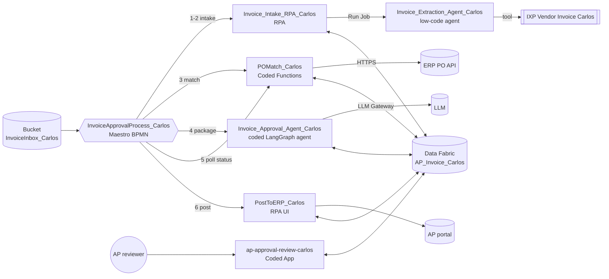

# Solution Design Document — Invoice Approval Solution

> **Template:** Solution overview (uipath-planner, Solution scope). One root SDD plus one per-project SDD per RPA process, agent, coded app and BPMN process. Coded Functions and the IXP model are documented inside their host SDDs.

---

## Document History

| Date | Version | Author | Role | Comments |
|---|---|---|---|---|
| 2026-10-05 | 1.0 | uipath-planner | Generated by AI Agent | Initial solution SDD generated from `invoice-approval-pdd.md` and its §16 gap analysis |

---

<!-- DO NOT RENAME: uipath-planner detects SDDs via this exact heading or the marker below. -->
<!-- planner-handoff:v1 -->
## Planner Handoff

| Field | Value |
|---|---|
| **Status** | ready |
| **Execution autonomy** | autonomous |
| **Delivery model** | cloud |
| **SDD scope** | solution |
| **Solution root SDD** | invoice-approval-solution-sdd.md |
| **Solution ID** | invoice-approval-solution |
| **Project SDD role** | root |
| **Project list section** | Project Inventory |
| **Tasks file** | `implementation-tasks.md` |
| **Generated by** | uipath-planner |
| **Generation date** | 2026-10-05 |
| **Template validation** | passed |

**Cross-project ordering notes for Lane A** (integrated components before their consumers):

1. IXP model `Vendor Invoice Carlos` → `Invoice_Extraction_Agent_Carlos` → `Invoice_Intake_RPA_Carlos`.
2. Data Fabric entity `AP_Invoice_Carlos` (27 fields) → every project that reads or writes the invoice record.
3. Coded Functions `POMatch_Carlos` (`process_invoice`, `get_invoice_status`) → `Invoice_Approval_Agent_Carlos` (consumes PO Matched / Approval Needed) and `InvoiceApprovalProcess_Carlos`.
4. `Invoice_Approval_Agent_Carlos`, `ap-approval-review-carlos`, `PostToERP_Carlos` → `InvoiceApprovalProcess_Carlos` (the BPMN orchestrates all of them and is built last).
5. Solution packaging (`uipath-solution`) is the terminal step after the BPMN.

Existing, verified components (gap analysis §16: implemented and verified) are **reuse** rows: Lane A emits verify/enhance tasks for them, never rebuild tasks.

---

## Decisions Made

> Autonomous mode picked the five architectural decisions below without a user checkpoint. Override by rerunning in Interactive mode or by editing the relevant SDD section.

| # | Decision | Picked | One-sentence reason |
|---|---|---|---|
| 1 | **Platform constraints** (Constraint Gate) | cloud; no products blocked | `uip login status` resolves to staging.uipath.com (Automation Cloud), full catalog. |
| 2 | **Scope** (Level 1) | Solution (IXP, 2 Agents, 2 RPA, Coded Functions, Coded App, Maestro BPMN, Data Fabric) | Six steps span extraction, rules, judgment, human review and UI posting across separate projects. |
| 3 | **RPA sub-type** (Level 1.5) | Process — `Invoice_Intake_RPA_Carlos`, `PostToERP_Carlos` | Both are callable end-to-end units with arguments; nothing is shared as a library. |
| 4 | **Authoring mode** (Level 2) | XAML — both RPA projects | Bodies are bucket/entity activity sequences and browser UI driving with minimal data shaping. |
| 5 | **Framework** | Sequence — both RPA projects | Maestro supplies per-invoice orchestration; each RPA job handles one record, so REFramework adds nothing. |

---

## Recommended Scope

**Recommendation:** SOLUTION(Maestro BPMN, Agents (low-code + coded), RPA Process ×2, Coded Functions, Coded App, IXP, Data Fabric)
**Delivery model:** cloud
**Blocked by platform:** none
**Need profile:** Turn each arriving vendor invoice into one governed record that is matched, approved when policy requires it, and posted exactly once — cutting manual entry and approval cycle time while preventing duplicate payment.

**Reasoning:**
- Semi-structured vendor documents (input structure) → IXP model consumed by a low-code extraction agent.
- Rule-expressible PO match, tolerance and threshold (deterministic) → Python Coded Functions.
- Evidence gathering plus a written recommendation (judgment, bounded by deterministic gates) → coded LangGraph agent.
- Asynchronous human approval with an audit trail (HITL, risk) → coded web app over Data Fabric, polled by the orchestrator.
- ERP reachable only through the AP portal UI (integration surface) → browser UI automation RPA on serverless.
- Cross-product, long-running, gateway-shaped lifecycle with timer waits (coordination shape, state) → Maestro BPMN.
- One record per invoice shared by every step (state, auditability) → Data Fabric entity.

**Alternatives considered:**
- Maestro Flow — rejected because the PDD has three explicit gateways, a timer-driven human wait and five end states, which BPMN models natively.
- Case Management — rejected because there are no stages with SLA ownership beyond one approval wait; the lifecycle state on the record is enough.
- Single RPA REFramework process — rejected because extraction and approval narrative need AI, and approval is asynchronous.
- Action Center task for review — rejected because the reviewer app already exists and is verified to write the decision fields.

---

## Action Required — SME Review Items

| # | Section | Item | Question | Default applied | Blocking |
|---|---|---|---|---|---|
| 1 | Cross-Project Data Flow | Vendor return (PDD OQ-1) | How is a structurally incomplete invoice returned to the vendor? | Instance ends "Invalid Invoice"; no vendor message is sent; AP handles return manually. | no |
| 2 | Cross-Project Data Flow | Approve unmatched PO (OQ-4) | May a reviewer approve a PO-mismatched invoice? | No — PO-mismatched invoices end "Held" (HOLD_PO_MISMATCH) and never reach the reviewer app. | no |
| 3 | Cross-Project Data Flow | Review time limit (OQ-5) | How long does the process wait for a decision, and who is escalated? | 6 polls × 2 minutes (about 13 minutes), then end "Held"; AP re-runs the instance. | no |
| 4 | Shared Assets & Queues | Rejection reason (OQ-6) | Free text or reason codes? Own field? | Free text appended to ApprovalPackageJson as `reviewerNote` (as built). | no |
| 5 | Shared Assets & Queues | Duplicate detection (OQ-8) | What identifies a duplicate invoice at intake? | Same InvoiceNumber → existing record reused (idempotent create); queue unique reference = record Id. | no |
| 6 | Solution Overview | Cycle-time targets (OQ-9) | Target arrival-to-posted time and discount window? | None set; measured from Processed Timestamp to posting. | no |
| 7 | Solution Overview | On-behalf approval (OQ-12) | Is AP-reviewer-on-behalf approval acceptable in production? | Yes for the lab; production requires the named approver. | no |
| 8 | Deployment | UAT / PROD environments | Which tenants/folders host UAT and PROD? | Only DEV (Training tenant) is defined. | no |

> These items are marked `[SME REVIEW]` in the document. Default-carried items (Blocking = no) do not block task derivation — the automation is built on the recorded defaults, which must be verified before production sign-off. Any Blocking = yes item keeps the handoff at `Status: draft`.

---

## Table of Contents

1. Solution Overview
2. Project Inventory
3. Cross-Project Data Flow
4. Shared Assets & Queues
5. Per-Project SDD Index
6. Non-Functional Requirements
7. Testing Strategy
8. Next Steps

---

## 1. Solution Overview

| Field | Value |
|---|---|
| **Solution name** | `InvoiceApprovalSolution_Carlos` |
| **Objective** | Automate the six-step vendor invoice approval lifecycle (PDD §6) end to end: extract, validate and create one record, PO match and approval check, approval package, human review, ERP posting. |
| **Department / Function** | Finance — Accounts Payable |
| **Business drivers** | Less manual invoice entry; shorter approval delays; captured early-payment discounts; no duplicate payments (PDD §1). |
| **Trigger** | One BPMN instance per invoice file in the `InvoiceInbox_Carlos` bucket (`FileName` input). |
| **End states** | Invalid Invoice (Rejected — structurally incomplete), Rejected (reviewer), Paid (POSTED), Held (PO mismatch or review timeout), Operational Failure. |
| **Orchestrator folder** | `Agentic Bootcamp/APAutomation_Carlos` (Standard). Solution deploys create child folders beneath it. |
| **Source PDD** | `invoice-approval-pdd.md` (sections 1–15 + §16 gap analysis) |
| **Data classification** | Confidential — vendor tax IDs, bank details, invoice amounts (PDD §11). |

### Business context and current state

The gap analysis (PDD §16) shows steps 1–4 implemented and verified, steps 5–6 partially implemented (no reviewer decision processed yet; no reviewer-approved invoice posted), and end-to-end orchestration target-state only. This solution therefore **reuses** the Lab 2–6 components and **adds** the Maestro BPMN process that wires them together, plus the hardening items listed per project.

### Target architecture

---

## 2. Project Inventory

| # | Project | Product | Sub-type / Framework | Role | PDD steps | Current state (PDD §16) | SDD |
|---|---|---|---|---|---|---|---|
| 1 | `Vendor Invoice Carlos` | IXP model (component) | Extraction model, tag `live` | Reads the eight invoice fields | 1 | Implemented and verified (v6) | inside `invoice-extraction-agent-sdd.md` |
| 2 | `Invoice_Extraction_Agent_Carlos` | Agent (low-code) | agent.json, IXP tool | Extraction service called by intake | 1 | Implemented and verified | `invoice-extraction-agent-sdd.md` |
| 3 | `Invoice_Intake_RPA_Carlos` | RPA Process | XAML, Sequence | Valid? gate, one idempotent record, optional queue item | 1–2 | Implemented and verified | `invoice-intake-rpa-sdd.md` |
| 4 | `POMatch_Carlos` | Coded Functions (Python, component) | 4 entry points | PO match, approval rule, status read | 3, 5 (poll) | Implemented and verified | inside `invoice-approval-process-sdd.md` |
| 5 | `Invoice_Approval_Agent_Carlos` | Agent (coded) | LangGraph | Four gates, approval package, LLM recommendation | 4 | Implemented and verified | `invoice-approval-agent-sdd.md` |
| 6 | `ap-approval-review-carlos` | Coded App (Web) | React + Vite + Tailwind | Reviewer approves / rejects | 5 | Partially implemented | `ap-approval-review-app-sdd.md` |
| 7 | `PostToERP_Carlos` | RPA Process | XAML, Sequence, UI automation | Posts to AP portal, sets POSTED | 6 | Partially implemented | `post-to-erp-sdd.md` |
| 8 | `InvoiceApprovalProcess_Carlos` | Maestro BPMN | `.bpmn` in solution `InvoiceApprovalSolution_Carlos` | End-to-end orchestration, gateways, timer wait | 1–6 | Target-state only | `invoice-approval-process-sdd.md` |
| — | `AP_Invoice_Carlos` | Data Fabric entity (shared resource) | 27 user fields | The single invoice record | 2–6 | Implemented and verified | this SDD §4 |

---

## 3. Cross-Project Data Flow

| # | From | To | Mechanism | Payload (format only) | PDD step / gateway |
|---|---|---|---|---|---|
| 1 | BPMN `intake` | `Invoice_Intake_RPA_Carlos` | Orchestrator StartJob (serverless) | in `FileName` (string), `CreateQueueItem`=false; out `RecordId` (GUID string), `IsValid`, `WasDuplicate` (bool), `ErrorMessage` | 1–2 |
| 2 | Intake RPA | `Invoice_Extraction_Agent_Carlos` | Run Job in solution sub-folder | in `SourceFile` (job attachment); out eight fields (strings, ISO dates, decimal total, ISO-4217 currency) | 1 |
| 3 | Extraction agent | IXP `Vendor Invoice Carlos` | Agent IXP tool, tag `live` | Document → extraction | 1 |
| 4 | Intake RPA | Data Fabric | Create record (idempotent on InvoiceNumber), `InvoiceLifecycleState=EXTRACTED` | eight fields + ProcessedTimestamp | 2 |
| 5 | BPMN gateway `gwValid` | — | reads `IsValid` | bool | Valid? |
| 6 | BPMN `poMatch` | `POMatch_Carlos_process_invoice` | StartJob, process env var `ERP_PO_LOOKUP_URL` | in `record_id`; out `po_matched`, `approval_required`, `match_reason` | 3 |
| 7 | `process_invoice` | ERP PO API | HTTPS GET, signed URL from env var (never logged) | PO number, vendor → PO status, vendor status, open amount | 3 |
| 8 | BPMN gateway `gwApproval` | — | reads `approval_required` | bool | Approval needed? |
| 9 | BPMN `prepareApproval` | `Invoice_Approval_Agent_Carlos` | StartJob (processType Agent) | in `recordId`; out `invoiceLifecycleState`, `approvalEvidenceState`, `missingApprovalFields`, `recommendation` | 4 |
| 10 | AP reviewer | `ap-approval-review-carlos` → Data Fabric | SDK `updateRecord` by entity name | `InvoiceLifecycleState` APPROVED/REJECTED, `ReviewedBy`, `ReviewedAt`, reviewer note | 5 |
| 11 | BPMN `pollStatus` | `POMatch_Carlos_get_invoice_status` | Timer PT2M loop, max 6 polls | in `record_id`; out `invoice_lifecycle_state`, `reviewed_by` set/unset | Approved? |
| 12 | BPMN `postToErp` | `PostToERP_Carlos` | StartJob (serverless) | in `RecordId`, `ApprovalConfirmed`, `PortalUrl`; out `Posted`, `WasAlreadyPosted`, `PostingId` | 6 |
| 13 | PostToERP | Data Fabric | Update record | `PostedToERP=true`, `InvoiceLifecycleState=POSTED` | 6 |

**Gateway outcomes** (detail in `invoice-approval-process-sdd.md` §5):

- Valid? no → **Invalid Invoice** end. `[SME REVIEW]` vendor return channel (item 1).
- Approval needed? no → straight to `postToErp` with `ApprovalConfirmed=false` → **Paid**.
- After the agent: HOLD_PO_MISMATCH → **Held** (item 2); AUTO_APPROVED → post; READY_FOR_APPROVAL / NEEDS_AP_REVIEW → wait loop.
- Approved? APPROVED → post with `ApprovalConfirmed=true` → **Paid**; REJECTED → **Rejected**; still waiting after 6 polls → **Held** (item 3).

**Idempotency chain:** intake reuses the record when the InvoiceNumber exists; the approval agent never downgrades APPROVED / REJECTED / POSTED; PostToERP returns `WasAlreadyPosted` instead of posting twice (PDD BR-5, BR-6, BR-7).

---

## 4. Shared Assets & Queues

| Resource | Type | Scope / location | Used by | Notes |
|---|---|---|---|---|
| `AP_Invoice_Carlos` | Data Fabric entity | Tenant | Intake RPA, POMatch, approval agent, app, PostToERP | 27 user fields (below). Never pass a folder key. |
| `InvoiceInbox_Carlos` | Storage bucket | `APAutomation_Carlos` | Intake RPA, BPMN input | Invoice PDFs at root. |
| `InvoiceQueue_Carlos` | Queue (unique reference) | `APAutomation_Carlos` | Intake RPA (batch mode), `POMatch_Carlos_process_invoice_queue` | Batch path only; the BPMN path passes `CreateQueueItem=false`. Reference = record Id. |
| `ERP_PO_LOOKUP_URL` | Process environment variable | on `POMatch_Carlos_process_invoice` and `_process_invoice_queue` | POMatch | Signed URL; contents never printed, saved or committed. Must be stripped from solution `resources/` before pack. |
| `PortalUrl` | Process argument value | BPMN → PostToERP | PostToERP | Hosted AP portal URL; never a localhost URL. |
| Default Serverless machine + Agentic Labs Robot | Runtime | Inherited from `Agentic Bootcamp` | All jobs | Never create machines, robots or roles. |
| IXP `Vendor Invoice Carlos` | IXP project | Tenant | Extraction agent | Tag `live` = v6. |

### Shared data model — `AP_Invoice_Carlos`

| Group | Fields (schema names) | Format |
|---|---|---|
| Extracted (PDD step 1) | VendorName, VendorTaxId, InvoiceNumber, InvoiceDate, PONumber, TotalAmount, Currency, DueDate | text; VendorTaxId confidential text; dates as date; TotalAmount decimal ≥ 0 (confidential); Currency ISO-4217 code (USD) |
| Processing | ProcessedTimestamp, POMatched, ApprovalNeeded, PostedToERP | datetime with TZ; booleans (missing PostedToERP = false) |
| Lifecycle | InvoiceLifecycleState | one of EXTRACTED, AUTO_APPROVED, HOLD_PO_MISMATCH, NEEDS_AP_REVIEW, READY_FOR_APPROVAL, APPROVED, REJECTED, POSTED |
| Approval inputs | GLAccount, CostCenter, Approver, PaymentTerms, VendorRiskScore, ReceiptReference, InvoiceLineSummary | text |
| Approval outputs | ApprovalEvidenceState, MissingApprovalFields, AgentRecommendation, ApprovalPackageJson, AgentProcessedAt | enum NOT_EVALUATED / NOT_REQUIRED / INCOMPLETE / COMPLETE; comma list; text; multiline JSON text; datetime with TZ |
| Reviewer decision | ReviewedBy, ReviewedAt | reviewer identity text; datetime with TZ |

Rejection reason: no dedicated field. `[SME REVIEW]` item 4 — stored as `reviewerNote` inside ApprovalPackageJson.

---

## 5. Per-Project SDD Index

| File | Project | Template | One-line scope |
|---|---|---|---|
| `invoice-approval-solution-sdd.md` | Solution root | Solution overview | Inventory, data flow, shared resources, ordering. |
| `invoice-extraction-agent-sdd.md` | `Invoice_Extraction_Agent_Carlos` (+ IXP `Vendor Invoice Carlos`) | Agent | Step 1 extraction of the eight fields from one invoice document. |
| `invoice-intake-rpa-sdd.md` | `Invoice_Intake_RPA_Carlos` | RPA | Step 2 Valid? gate and the single idempotent invoice record. |
| `invoice-approval-agent-sdd.md` | `Invoice_Approval_Agent_Carlos` | Agent | Step 4 gates, approval package and recommendation. |
| `ap-approval-review-app-sdd.md` | `ap-approval-review-carlos` | Coded App | Step 5 reviewer approve / reject with audit fields. |
| `post-to-erp-sdd.md` | `PostToERP_Carlos` | RPA | Step 6 ready-to-post check, portal posting, POSTED state. |
| `invoice-approval-process-sdd.md` | `InvoiceApprovalProcess_Carlos` (+ Coded Functions `POMatch_Carlos`) | Maestro BPMN | End-to-end orchestration, step 3 matching, three gateways, timer wait. |

---

## 6. Non-Functional Requirements

| Dimension | Requirement / Design decision |
|---|---|
| **Security** | Tax IDs, bank details and amounts stay on the record and in the reviewer app only; no project logs them, puts them in agent/graph state beyond need, or writes them to documentation (PDD §11). The signed ERP URL lives in a process environment variable, is never printed, and is stripped from solution resources before pack. Function code silences httpx INFO logging. |
| **Performance** | Serverless runtime for every job; one job per BPMN step per invoice. The review poll is PT2M (never faster) to limit serverless job starts. |
| **Scalability** | One BPMN instance per invoice; instances are independent. Batch intake via the unique-reference queue remains available for backlog runs. |
| **Availability / Resilience** | Every component is idempotent (create-or-reuse, no downgrade, no double post); every BPMN service task has an error boundary to Operational Failure, so re-running an instance is safe. |
| **Logging & Monitoring** | Correlation key = Data Fabric record Id across all jobs. Maestro element executions are the live view; Orchestrator job lists per sub-folder. |
| **Compliance** | Auditable decision trail: ReviewedBy, ReviewedAt, ApprovalPackageJson, AgentProcessedAt, PostingId. |

---

## 7. Testing Strategy

Each project SDD carries its own thorough test section. Solution-level end-to-end tests (all run through the BPMN):

| ID | Scenario | Setup (format) | Expected end | Assertions |
|---|---|---|---|---|
| E2E-01 | Auto-approved | Invoice with matched PO, total ≤ threshold | Paid | One record; AUTO_APPROVED path skips agent wait and app; POSTED; PostedToERP true. |
| E2E-02 | Reviewer approves | Invoice above threshold with complete evidence | Paid | Instance waits in timer loop; after approval in the app it resumes within one cycle; same record POSTED; ReviewedBy/At set. |
| E2E-03 | Reviewer rejects | As E2E-02, reviewer rejects with a note | Rejected | REJECTED; PostedToERP false; reviewer note in package. |
| E2E-04 | Structurally incomplete | Document missing PO number or total | Invalid Invoice | No record created; IsValid false. |
| E2E-05 | PO mismatch | PO missing / vendor inactive / outside 2% | Held | HOLD_PO_MISMATCH; no app decision possible; not posted. |
| E2E-06 | Evidence incomplete | Approval inputs missing | Paid or Rejected after review | NEEDS_AP_REVIEW with MissingApprovalFields listed; app shows the incomplete-evidence note. |
| E2E-07 | Review timeout | No decision within 6 polls | Held | PollCount reaches 6; record unchanged. |
| E2E-08 | Duplicate file | Same invoice submitted twice | Paid once | WasDuplicate true on second run; WasAlreadyPosted true; one posting. |
| E2E-09 | ERP unreachable | ERP URL env var missing or expired | Operational Failure | Error boundary fires; record not marked matched. |
| E2E-10 | Secret hygiene | After pack and runs | — | 0 hits for `access_token=` in solution resources and zip; 0 tax IDs or amounts in job logs and docs. |

Reserved test data: use files that are not reserved for later lab steps (Lab 10 Steps 4–5 reserve 007 and 009). All data synthetic.

---

## 8. Next Steps

This SDD set captures architecture and decisions. To generate the implementation task list, load `uipath-planner` with this root SDD:

> Load `uipath-planner`. SDD path: `invoice-approval-solution-sdd.md`.

The planner reads this root handoff, verifies every child SDD in §5 (same Solution ID, `Status: ready`), merges shared resources, and writes ONE canonical task file, `implementation-tasks.md`, routing work to `uipath-ixp`, `uipath-agents`, `uipath-rpa`, `uipath-functions`, `uipath-coded-apps`, `uipath-maestro-bpmn`, `uipath-platform` and `uipath-solution`.

### Terminal artefact

The deliverable is the packed solution `InvoiceApprovalSolution_Carlos` (`.uipx` manifest committed, build zips ignored), via `uipath-solution`: `uip solution init` → `projects add` → `resources refresh` (then strip environment variables from `resources/`) → `pack` → `publish` → `deploy config link` the five existing Lab processes → `deploy run`. Each deploy creates a new child folder under `APAutomation_Carlos`; older deployments stay until the facilitator removes them.

---

**End of Solution Design Document.**
