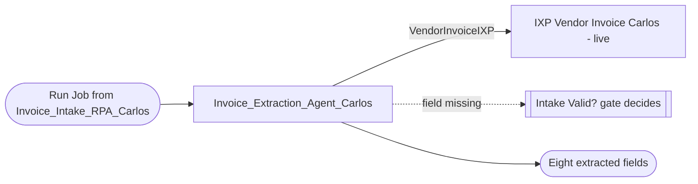

# Solution Design Document — Invoice_Extraction_Agent_Carlos

> **Template:** UiPath Agents. Hosts the IXP model `Vendor Invoice Carlos` (no separate SDD for the model).

---

## Document History

| Date | Version | Author | Role | Comments |
|---|---|---|---|---|
| 2026-10-05 | 1.0 | uipath-planner | Generated by AI Agent | Initial SDD generated from `invoice-approval-pdd.md` and its §16 gap analysis |

---

<!-- DO NOT RENAME: uipath-planner detects SDDs via this exact heading or the marker below. -->
<!-- planner-handoff:v1 -->
## Planner Handoff

| Field | Value |
|---|---|
| **Status** | ready |
| **Execution autonomy** | autonomous |
| **Delivery model** | cloud |
| **SDD scope** | solution |
| **Solution root SDD** | invoice-approval-solution-sdd.md |
| **Solution ID** | invoice-approval-solution |
| **Project SDD role** | child |
| **Independently executable** | no — Lane A derives tasks only via the Solution root |
| **Project list section** | §9 Project Structure |
| **Tasks file** | `implementation-tasks.md` |
| **Generated by** | uipath-planner |
| **Generation date** | 2026-10-05 |
| **Template validation** | passed |

---

## Decisions Made

> Autonomous mode picked the five architectural decisions below without a user checkpoint. Override by rerunning in Interactive mode or by editing the relevant SDD section.

| # | Decision | Picked | One-sentence reason |
|---|---|---|---|
| 1 | **Platform constraints** (Constraint Gate) | cloud; no products blocked | Automation Cloud tenant; Agents and IXP available. |
| 2 | **Scope** (Level 1) | Agent inside Solution `invoice-approval-solution` | Extraction is one bounded capability called by intake. |
| 3 | **Agent type** | Low-code agent (agent.json) | One tool call and a fixed output schema; no custom control flow. |
| 4 | **Extraction engine** | IXP `Vendor Invoice Carlos`, tag `live` | Vendor layouts vary; a trained model beats templates on changing documents. |
| 5 | **Determinism** | temperature 0, structured output only | The agent maps model output to the schema; it does not decide business outcomes. |

---

## Recommended Scope

**Recommendation:** SOLUTION(Maestro BPMN, Agents, RPA Process ×2, Coded Functions, Coded App, IXP, Data Fabric) — this file: Agent (low-code) + IXP component
**Delivery model:** cloud
**Blocked by platform:** none
**Need profile:** Read eight invoice fields from a semi-structured vendor PDF accurately enough that no one keys them by hand.

---

## Action Required — SME Review Items

| # | Section | Item | Question | Default applied | Blocking |
|---|---|---|---|---|---|
| 1 | §8 IXP | Model deployment | Should the IXP model get an Orchestrator folder deployment instead of tag-based use? | Keep tag `live` (as built); no folder deployment. | no |
| 2 | §5 | Accuracy target | What field accuracy is required on production documents? | 100% on the 5 lab documents; production target to be agreed. | no |

> These items are marked `[SME REVIEW]` in the document. Default-carried items (Blocking = no) do not block task derivation — the automation is built on the recorded defaults, which must be verified before production sign-off. Any Blocking = yes item keeps the handoff at `Status: draft`.

---

## Table of Contents

1. Agent Overview
2. Agent Framework
3. Tools
4. Memory / RAG
5. Evaluation Criteria
6. Orchestrator Bindings
7. Error Handling & Escalation
8. Integrated Components
9. Project Structure
10. Testing Strategy
11. Next Steps

---

## 1. Agent Overview

| Field | Value |
|---|---|
| **Agent name** | `Invoice_Extraction_Agent_Carlos` |
| **Role** | Invoice Data Extraction Agent |
| **Objective** | Return the eight PDD step-1 fields for one invoice document. |
| **Trigger** | Run Job from `Invoice_Intake_RPA_Carlos` (FolderPath `Agentic Bootcamp/APAutomation_Carlos/Invoice_Extraction_Agent_Carlos`). |
| **Expected LLM model** | `gpt-5.4` (as configured), temperature 0 |
| **Expected volume** | One invocation per arriving invoice `[SME REVIEW]` daily volume not stated in the PDD |
| **Source PDD** | `invoice-approval-pdd.md` §6 Step 1, §9 |

### In Scope

- Call the IXP model on the source document and map its fields to the output schema.
- Normalise dates to ISO date, total to a bare decimal, currency to an ISO-4217 code.
- Return empty values for fields the model cannot find (the intake Valid? gate decides).

### Out of Scope

- Structural validation, record creation and duplicate handling (intake RPA).
- PO matching, approval decisions, posting.

### Assumptions

- One document = one invoice (PDD A-4).
- All invoices are USD (PDD A-1).
- The IXP project stays on tag `live`; publishing a new version moves `live`.

---

## 2. Agent Framework

**Selected framework:** Low-code agent (agent.json, Agent Builder) — equivalent to Simple Function

| Framework | Best For | Chosen? |
|---|---|---|
| Simple Function | Single-turn Q&A, no tool chaining | YES (low-code agent.json) |
| LangGraph | Complex multi-step reasoning, state machines | NO |
| LlamaIndex | RAG-heavy agents, document search | NO |
| OpenAI Agents | OpenAI-native tool calling | NO |

**Justification:** The agent makes a single IXP tool call and returns a fixed eight-field schema. No branching, memory or retries beyond the platform's own are needed, so a low-code agent keeps the build in Studio Web and lets the solution deploy it as-is.

---

## 3. Tools

| Tool Name | Tool Type | Repo / IS URL | Purpose | Input Schema | Output Schema |
|---|---|---|---|---|---|
| `VendorInvoiceIXP` | IXP extraction (agent resource, `versionTag: live`) | — | Extract invoice fields from the document | `SourceFile` (job attachment, PDF) | Field group "Vendor Invoice": eight fields with confidence |

### Tool Invocation Policy

- `VendorInvoiceIXP`: call exactly once per run, on `SourceFile`. Do not call when `SourceFile` is missing; return an error instead.

### Agent Configuration

| Field | Value |
|---|---|
| **Agent type** | FUNCTIONAL |
| **Primary function** | Document → eight structured invoice fields |
| **Agent hosting** | CLOUD (staging.uipath.com, Training tenant) |
| **Arguments — in** | `SourceFile` (file / job attachment) |
| **Arguments — out** | `VendorName`, `VendorTaxId`, `InvoiceNumber`, `PONumber`, `Currency` (string); `InvoiceDate`, `DueDate` (ISO date string); `TotalAmount` (decimal) |

### Agent Interaction Diagram



---

## 4. Memory / RAG

### Short-term Memory

- [ ] Required
- [x] Not required

**Purpose:** NONE — single-turn extraction.

### Long-term Memory

- [ ] Required (via UiPath memory service or external store)
- [x] Not required

**Purpose:** NONE

### RAG Sources

| Source Name | Type | Description | Indexing Strategy |
|---|---|---|---|
| — | — | Not required; the IXP model is the only knowledge source. | — |

---

## 5. Evaluation Criteria

### Success Metrics

| Metric | Target | Measurement |
|---|---|---|
| Field accuracy (8 fields) | 100% on the validated set (PDD AC-1) `[SME REVIEW]` production target | Eval set vs `lab1-ixp/reference/expected-extractions.json`; dates compared as dates |
| IXP model score | F1 ≥ 0.95 per field | `uip ixp projects get-metrics` (currently F1 = 1 at v6) |
| Run success rate | 100% successful jobs on valid documents | Orchestrator job list |

### Trajectory Evaluation

| Test Case | Expected Tool Sequence | Acceptable Variations |
|---|---|---|
| Standard invoice | `VendorInvoiceIXP` → return | none |
| Missing PO number | `VendorInvoiceIXP` → return with empty PONumber | none |

### LLM-Judge Criteria

| Criterion | Description | Pass Threshold |
|---|---|---|
| Schema conformance | Output has exactly the eight keys with the stated formats | 100% |
| No invention | Empty field returned when the document lacks it; no guessed values | 100% |

---

## 6. Orchestrator Bindings

| Binding Name | Resource Type | Purpose |
|---|---|---|
| `VendorInvoiceIXP` | IXP project (`Vendor Invoice Carlos`, tag `live`) | Extraction tool |
| Solution folder | Folder `…/APAutomation_Carlos/Invoice_Extraction_Agent_Carlos` | Deployment target of solution `Invoice_Extraction_Agent_Carlos` |

---

## 7. Error Handling & Escalation

### Agent-level errors

| Error Scenario | Handling |
|---|---|
| Tool invocation fails | RETURN_ERROR — job faults; intake records the file as rejected with ErrorMessage and continues. |
| LLM refuses or returns invalid output | RETURN_ERROR — no partial record is created. |
| Rate limit hit | Platform backoff; intake may re-run the file (record creation is idempotent). |

### HITL Escalation

| Scenario | Escalation Type | Who Resolves |
|---|---|---|
| Low-confidence or unreadable field | None in the agent — the intake Valid? gate rejects missing PO/total; other gaps stay visible on the record (PDD EX-2) | AP reviewer |

**Note:** No HITL is wired in this agent. Human review happens later in the reviewer app.

---

## 8. Integrated Components

### RPA Processes Called as Tools

| Process Name | Tool Name | Purpose |
|---|---|---|
| — | — | None |

### API Workflows Called as Tools

| API Workflow Name | Tool Name | Purpose |
|---|---|---|
| — | — | None |

### Integration Service Connectors

| Connector | Tool Name | Operation |
|---|---|---|
| — | — | None |

### Integration Service Connections

| Connector | System | Access Method | Used By |
|---|---|---|---|
| — | — | — | None |

### IXP / Document Understanding Models

| Model / Project | Used By Tool | Document Types | Purpose |
|---|---|---|---|
| `Vendor Invoice Carlos` (slug `vendor-invoice-carlos-89ac9c10-ixp`), tag `live` = v6 | `VendorInvoiceIXP` | Vendor invoice PDF | Extract VendorName, VendorTaxId, InvoiceNumber, InvoiceDate, PONumber, TotalAmount, Currency, DueDate |

**IXP model contract** (component — built and published before this agent):

| Item | Decision |
|---|---|
| Field group | `Vendor Invoice`, eight fields as above |
| Data types | Dates → Date (`YYYY-MM-DDT00:00:00Z`, compare as dates); Total Amount → Number (bare decimal); others → Text |
| Training state | 5 validated documents, project score "excellent" (v6) |
| Retraining | Confirming labels retrains automatically; wait for the model version to increase; then publish so `live` moves |
| Deployment | Tag-based (`live`); no folder deployment `[SME REVIEW]` item 1 |

---

## 9. Project Structure

### Implementation Mode

- [ ] **Coded Agent** (Python) — recommended for complex logic, custom frameworks
- [x] **Low-code Agent** (agent.json via Agent Builder) — recommended for simple agents

### Coded Agent Structure

Not used — this is a low-code agent.

### Low-code Agent Structure

```text
lab2-rpa/Invoice_Extraction_Agent_Carlos/
├── Invoice_Extraction_Agent_Carlos.uipx
└── Invoice_Extraction_Agent_Carlos/
    ├── agent.json
    ├── entry-points.json
    ├── bindings_v2.json
    ├── project.uiproj
    ├── evals/
    │   ├── eval-sets/evaluation-set-default.json
    │   └── evaluators/
    └── resources/
        └── VendorInvoiceIXP/resource.json   (projectName "Vendor Invoice Carlos", versionTag live, guardrail.policies [])
```

### Solution / Project Breakdown

| Project | Product (RPA / API / Agent / …) | GitHub Repository | Folder | Attended / Unattended |
|---|---|---|---|---|
| `Invoice_Extraction_Agent_Carlos` | Agent (low-code) | `UiPath-Coders/commercial_bootcamp_Carlos` (`lab2-rpa/`) | `Agentic Bootcamp/APAutomation_Carlos/Invoice_Extraction_Agent_Carlos` | N-A (serverless) |
| `Vendor Invoice Carlos` | IXP model | — (tenant IXP project) | Tenant | N-A |

### Reusable Components

| Type (reused / new-reusable) | Name | Details |
|---|---|---|
| reused | IXP `Vendor Invoice Carlos` | v6, tag `live` |
| reused | Agent solution `Invoice_Extraction_Agent_Carlos` 1.0.0 | Deployed; 6 successful jobs |

### Environments (DEV / UAT / PROD)

| Item | DEV | UAT | PROD | Used By |
|---|---|---|---|---|
| Orchestrator + Tenant/Service | staging.uipath.com / customersuccessamer / Training | [SME REVIEW] | [SME REVIEW] | All |
| Folder | `Agentic Bootcamp/APAutomation_Carlos/Invoice_Extraction_Agent_Carlos` | [SME REVIEW] | [SME REVIEW] | This agent |

### Non-Functional Requirements

| Dimension | Requirement / Design decision |
|---|---|
| **Security** | Output includes VendorTaxId (confidential); it goes only to the intake job output and the record, never to logs or chat. No credentials in agent.json. |
| **Performance** | One IXP call per document; temperature 0. |
| **Scalability** | Serverless; one job per document. |
| **Availability / Resilience** | Intake can re-run a file safely (idempotent record create). |
| **Logging & Monitoring** | Agent traces in Orchestrator; job state per file. |
| **Compliance** | PDD §11 confidentiality. |

---

## 10. Testing Strategy

### Canonical Test Case

| Input | Expected Output |
|---|---|
| A lab invoice PDF from `lab2-rpa/` | Eight fields equal to `lab1-ixp/reference/expected-extractions.json` → `invoices[].expected` (dates as dates, total as decimal) |

### Evaluation Dataset

| Test ID | Input | Expected Trajectory | LLM-Judge Criteria |
|---|---|---|---|
| T-01 | Each of the 5 lab invoices | `VendorInvoiceIXP` → return | Exact match on eight fields |
| T-02 | Invoice with PO number removed | `VendorInvoiceIXP` → return | PONumber empty; no invented value |
| T-03 | Invoice with total removed | `VendorInvoiceIXP` → return | TotalAmount empty |
| T-04 | Non-invoice PDF | `VendorInvoiceIXP` → return | Empty fields; intake rejects |
| T-05 | Missing `SourceFile` | none | Error returned, no tool call |

### Regression Strategy

- Run evaluation dataset on every code change
- Track pass rate over time
- Any drop below 100% on T-01 blocks deployment

---

## 11. Next Steps

Load `uipath-planner` with the Solution root, not this child:

> Load `uipath-planner`. SDD path: `invoice-approval-solution-sdd.md`.

Lane A writes the shared task file `implementation-tasks.md`, routing IXP verification to `uipath-ixp` and agent verification / redeploy to `uipath-agents`, ordered before `Invoice_Intake_RPA_Carlos`.

Implementation tasks **do not live in this SDD** — they live in the planner's output.

---

**End of Solution Design Document.**
