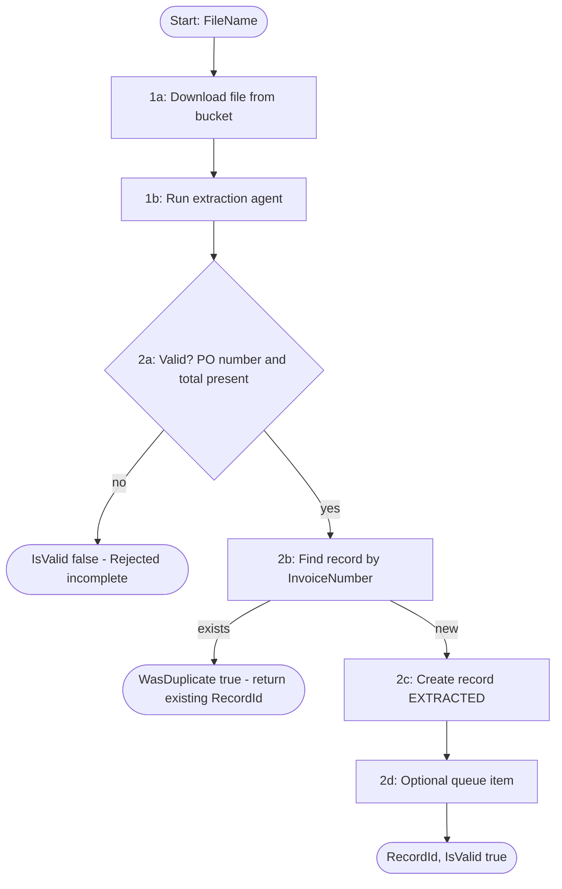

# Solution Design Document — Invoice_Intake_RPA_Carlos

> **Template:** RPA Process / Library / Test Automation. Single project (§10 Option B), XAML, Sequence.

---

## Document History

| Date | Version | Author | Role | Comments |
|---|---|---|---|---|
| 2026-10-05 | 1.0 | uipath-planner | Generated by AI Agent | Initial SDD generated from `invoice-approval-pdd.md` and its §16 gap analysis |

---

<!-- DO NOT RENAME: uipath-planner detects SDDs via this exact heading or the marker below. -->
<!-- planner-handoff:v1 -->
## Planner Handoff

| Field | Value |
|---|---|
| **Status** | ready |
| **Execution autonomy** | autonomous |
| **Delivery model** | cloud |
| **SDD scope** | solution |
| **Solution root SDD** | invoice-approval-solution-sdd.md |
| **Solution ID** | invoice-approval-solution |
| **Project SDD role** | child |
| **Independently executable** | no — Lane A derives tasks only via the Solution root |
| **Project list section** | §11 |
| **Tasks file** | `implementation-tasks.md` |
| **Generated by** | uipath-planner |
| **Generation date** | 2026-10-05 |
| **Template validation** | passed |

---

## Decisions Made

> Autonomous mode picked the five architectural decisions below without a user checkpoint. Override by rerunning in Interactive mode or by editing the relevant SDD section.

| # | Decision | Picked | One-sentence reason |
|---|---|---|---|
| 1 | **Platform constraints** (Constraint Gate) | cloud; no products blocked | Automation Cloud tenant; serverless runtime available. |
| 2 | **Scope** (Level 1) | RPA Process inside Solution `invoice-approval-solution` | Deterministic validate-and-create step with bucket, agent and entity activities. |
| 3 | **RPA sub-type** (Level 1.5) | Process | Callable unit with in/out arguments, started by Maestro or manually. |
| 4 | **Authoring mode** (Level 2) | XAML | Activity sequence (bucket, Run Job, Data Fabric); no heavy data shaping. |
| 5 | **Framework** | Sequence | One file per call from Maestro; batch mode is a simple loop; no transaction retry needed. |

---

## Recommended Scope

**Recommendation:** SOLUTION(Maestro BPMN, Agents, RPA Process ×2, Coded Functions, Coded App, IXP, Data Fabric) — this file: RPA Process `Invoice_Intake_RPA_Carlos`
**Delivery model:** cloud
**Blocked by platform:** none
**Need profile:** Turn each extracted invoice into exactly one invoice record, or reject it as structurally incomplete, without manual keying.

---

## Action Required — SME Review Items

| # | Section | Item | Question | Default applied | Blocking |
|---|---|---|---|---|---|
| 1 | §7 B1 | Vendor return (PDD OQ-1) | How is an incomplete invoice returned to the vendor? | No vendor message; IsValid false and ErrorMessage returned; BPMN ends Invalid Invoice. | no |
| 2 | §7 B3 | Duplicate rule (OQ-8) | Is InvoiceNumber alone the duplicate key? | InvoiceNumber (as built). | no |
| 3 | §1 | Volume | Daily invoice volume and peak? | Not stated; sized at 1 serverless job per file. | no |
| 4 | §16 | UAT / PROD | Target tenants/folders beyond DEV? | DEV only. | no |

> These items are marked `[SME REVIEW]` in the document. Default-carried items (Blocking = no) do not block task derivation — the automation is built on the recorded defaults, which must be verified before production sign-off. Any Blocking = yes item keeps the handoff at `Status: draft`.

---

## Table of Contents

1. Process Overview
2. Process Map
3. Detailed Process Steps
4. Business Rules
5. Data Definitions
6. Value Mappings
7. Exception Handling
8. Error Handling
9. Application Inventory
10. Master Project Architecture
11. Project Structure
12. Queue Architecture
13. Implementation Mode
14. Packages
15. Credentials & Assets
16. Deployment Environment
17. Testing Strategy
18. Next Steps

---

## 1. Process Overview

| Field | Value |
|---|---|
| **Process name** | `Invoice_Intake_RPA_Carlos` |
| **Objective** | PDD steps 1–2: get the eight fields for one invoice file (via the extraction agent), apply the Valid? rule, and create or reuse the single invoice record. |
| **Department / Function** | Finance — Accounts Payable intake |
| **Schedule** | On demand: one job per invoice from the BPMN (`FileName` set); batch mode (blank `FileName`) for backlog. |
| **Volume** | [SME REVIEW] not stated in the PDD |
| **Avg. handling time (manual)** | [SME REVIEW] not stated |
| **Avg. handling time (automated target)** | Under 2 minutes per file [DEFAULT] |
| **Exception rate** | [SME REVIEW] not stated |
| **Source PDD** | `invoice-approval-pdd.md` §6 Steps 1–2, §8 BR-1/BR-5 |

### Delivery Team

| Role | Name | Contact |
|---|---|---|
| SME / Process Owner | Accounts Payable (PDD) | — |

### In Scope

- Download the named file from `InvoiceInbox_Carlos`.
- Call `Invoice_Extraction_Agent_Carlos` and read its eight fields.
- Valid? gate: PONumber present AND TotalAmount present and numeric.
- Create the record with `InvoiceLifecycleState = EXTRACTED`, or reuse the existing record for the same InvoiceNumber.
- Optionally create a queue item (Reference = record Id) for batch processing.

### Out of Scope

- PO matching, approval, posting.
- Vendor return messages (`[SME REVIEW]` item 1).

### Assumptions

- The extraction agent is deployed in `…/APAutomation_Carlos/Invoice_Extraction_Agent_Carlos`.
- `AP_Invoice_Carlos` holds 27 user fields; this project writes only the eight extracted fields, ProcessedTimestamp and InvoiceLifecycleState.
- Invalid invoices get no record (PDD §9.1).

---

## 2. Process Map



| Step | Description | Application |
|---|---|---|
| 1a | Download invoice file | Orchestrator storage bucket |
| 1b | Extract eight fields | `Invoice_Extraction_Agent_Carlos` |
| 2a | Valid? gate | — |
| 2b | Duplicate check | Data Fabric |
| 2c | Create record | Data Fabric |
| 2d | Queue item (batch / opt-in) | Orchestrator queue |

---

## 3. Detailed Process Steps

### Step Summary

| # | Action | Application | Input | Output | Rules | Errors |
|---|---|---|---|---|---|---|
| 1a | Download `FileName` (or list all files in batch mode) | Bucket `InvoiceInbox_Carlos` | FileName | Local file | — | E1 |
| 1b | Run Job of the agent with the file as attachment | Extraction agent | File | Eight fields | BR-07 | E2 |
| 2a | Evaluate structural validity | — | PONumber, TotalAmount | IsValid | BR-01, BR-02 | B1 |
| 2b | Query records by InvoiceNumber | Data Fabric | InvoiceNumber | Existing Id or none | BR-03 | B3, E3 |
| 2c | Create record | Data Fabric | Eight fields | RecordId | BR-04, BR-05, BR-06 | E3 |
| 2d | Add queue item when enabled | Queue `InvoiceQueue_Carlos` | RecordId | Queue item | BR-08 | B4 |

### Step Details

#### Step 2b–2c — Idempotent record creation

Query with a sort only and filter by InvoiceNumber in the workflow (VB LINQ). When a record exists, return its Id with `WasDuplicate = true` and do not write. This is the PDD BR-5 "single record" guarantee for intake.

---

## 4. Business Rules

| ID | Rule Name | Description | Trigger Condition | Validation (regex / range / type / allowed values) | Affected Steps |
|---|---|---|---|---|---|
| BR-01 | PO number required | PDD BR-1 | Every file | `PONumber` non-empty after trim | 2a |
| BR-02 | Total required | PDD BR-1 | Every file | `TotalAmount` parses as decimal ≥ 0 | 2a |
| BR-03 | Single record | PDD BR-5 | Valid invoice | At most 1 record per InvoiceNumber | 2b |
| BR-04 | Initial lifecycle | Created record starts EXTRACTED | Create | allowed values `{EXTRACTED}` | 2c |
| BR-05 | Processed timestamp | Set on create | Create | DateTime with TZ, UTC | 2c |
| BR-06 | Dates | InvoiceDate, DueDate stored as dates | Create | ISO date `^\d{4}-\d{2}-\d{2}` | 2c |
| BR-07 | Currency | USD only (PDD A-1) | Create | allowed values `{USD}` | 1b, 2c |
| BR-08 | Queue reference | Queue item Reference = record Id | Queue enabled | GUID `^[0-9a-fA-F-]{36}$` | 2d |
| BR-09 | Unset flags | POMatched, ApprovalNeeded, PostedToERP left unset | Create | missing (treated as false by readers) | 2c |
| BR-10 | Output RecordId | Returned for valid invoices | Valid | GUID string; empty when IsValid false | 2b–2c |

---

## 5. Data Definitions

### Option B — XAML Mode

#### Transaction Data (Dictionary)

| Key | Type | Source | Description |
|---|---|---|---|
| VendorName | String | Agent output | Vendor legal name |
| VendorTaxId | String | Agent output | Confidential; never logged |
| InvoiceNumber | String | Agent output | Duplicate key |
| InvoiceDate | String (ISO date) | Agent output | |
| PONumber | String | Agent output | Required |
| TotalAmount | Decimal | Agent output | Required; confidential |
| Currency | String | Agent output | ISO-4217 |
| DueDate | String (ISO date) | Agent output | |

#### Output Data (Dictionary)

| Key | Type | Description |
|---|---|---|
| RecordId | String | Data Fabric record Id (GUID) |
| IsValid | Boolean | Valid? result |
| WasDuplicate | Boolean | Existing record reused |
| ErrorMessage | String | Reason for rejection or failure (no field values) |
| ProcessedCount / CreatedCount / RejectedCount | Int32 | Batch counters |

#### Status/Category Values

| Variable | Allowed Values |
|---|---|
| InvoiceLifecycleState (written) | EXTRACTED |
| itemStatus (internal) | Created, Duplicate, Rejected |

---

## 6. Value Mappings

### Agent output — to Data Fabric

| Source Value | Target Value |
|---|---|
| `TotalAmount` (decimal string) | `TotalAmount` (decimal) |
| `InvoiceDate` / `DueDate` (ISO date) | date fields |
| empty string | field omitted (null) |

---

## 7. Exception Handling

| ID | Exception Name | Trigger Step | Trigger Condition | Action |
|---|---|---|---|---|
| B1 | Structurally incomplete | 2a | PONumber or TotalAmount missing (PDD EX-1) | IsValid false, RejectedCount + 1, no record; `[SME REVIEW]` vendor return |
| B2 | Optional field missing | 2a | Other field empty (PDD EX-2) | Still valid; field left empty on the record |
| B3 | Duplicate invoice | 2b | InvoiceNumber exists (PDD EX-12) | WasDuplicate true; return existing Id; no write |
| B4 | Duplicate queue reference | 2d | Queue rejects reference | Treat as already queued; continue |

**Default handler:** For any unanticipated business exception, mark the file rejected with ErrorMessage and continue with the next file.

---

## 8. Error Handling

| ID | Error Name | Trigger Step | Trigger Condition | Retry Policy | Action |
|---|---|---|---|---|---|
| E1 | File not found / bucket error | 1a | Download fails | 0 (BPMN error boundary owns retry) | ErrorMessage; job faults → Operational Failure |
| E2 | Agent job failed | 1b | Run Job not Successful | 0 | ErrorMessage; no record |
| E3 | Data Fabric failure | 2b–2c | Query/create error | 0 | ErrorMessage; re-run is safe (BR-03) |

**Default handler:** For any unanticipated system error, set ErrorMessage without field values and fault the job.

---

## 9. Application Inventory

| # | Application | Interface | Access Method | Role | Interaction Pattern | Session Management |
|---|---|---|---|---|---|---|
| 1 | Orchestrator storage bucket `InvoiceInbox_Carlos` | API | UiPath.System.Activities storage activities | SOURCE | READ | PER_RUN |
| 2 | `Invoice_Extraction_Agent_Carlos` | API | Run Job (FolderPath of solution sub-folder) | UTILITY | READ | PER_ITEM |
| 3 | Data Fabric `AP_Invoice_Carlos` | API | UiPath.DataService.Activities (entity store) | TARGET | READ-WRITE | PER_ITEM |
| 4 | Queue `InvoiceQueue_Carlos` | API | UiPath.System.Activities Add Queue Item | TARGET | WRITE | PER_ITEM |

### Interactive Authentication / Re-auth Handoff

Not applicable — no human login; all access runs under the robot identity.

### Integration Service Connections

| Connector | System | Access Method | Used By |
|---|---|---|---|
| — | — | — | None (platform activities only) |

### IXP / Document Understanding Models

| Model / Project | Called From Workflow / Step | Document Types | Purpose |
|---|---|---|---|
| `Vendor Invoice Carlos` (via the extraction agent) | `ExtractInvoiceData.xaml` / 1b | Vendor invoice PDF | Eight fields (contract in `invoice-extraction-agent-sdd.md` §8) |

---

## 10. Master Project Architecture

### Option B — Single Project

**Decomposition signals matched:** 0-1 (threshold not met)

> Skip this section. §11 describes a single project. §12 applies because the project produces queue items in batch mode.

---

## 11. Project Structure

### Solution / Project Breakdown

| Project | Product (RPA / API / Agent / …) | GitHub Repository | Folder | Attended / Unattended |
|---|---|---|---|---|
| `Invoice_Intake_RPA_Carlos` | RPA Process | `UiPath-Coders/commercial_bootcamp_Carlos` (`lab2-rpa/`) | `Agentic Bootcamp/APAutomation_Carlos` | Unattended (serverless) |

### Reusable Components

| Type (reused / new-reusable) | Name | Details |
|---|---|---|
| reused | `Invoice_Intake_RPA_Carlos` 1.0.0 | Published; 2 successful jobs; 5 records created |
| reused | Entity store `.entities/EntitiesStore.json` | Namespace `Invoice_Intake_RPA_Carlos` |

### Project Type

| # | Project Name | Sub-type |
|---|---|---|
| 1 | `Invoice_Intake_RPA_Carlos` | Process |

### Project Mode Decision

| # | Project | Type | Compatibility | Authoring | Attendance | Initiation | Framework | Persistence (long-running) | Packaging |
|---|---|---|---|---|---|---|---|---|---|
| 1 | `Invoice_Intake_RPA_Carlos` | Process | Cross-platform (Portable) | XAML | Unattended | API (Maestro StartJob) / Manual | Sequence | NO | Solution (.uipx) — linked into `InvoiceApprovalSolution_Carlos` |

### Recommended Structure

#### Sequence layout (for Dispatcher / Reporting / simple projects)

```text
Invoice_Intake_RPA_Carlos/
├── project.json
├── Main.xaml
├── ProcessInvoiceFile.xaml
├── ExtractInvoiceData.xaml
├── CreateInvoiceRecord.xaml
└── .entities/EntitiesStore.json
```

### Workflow Inventory

| # | Workflow File | Responsibility | PDD Steps | Inputs | Outputs |
|---|---|---|---|---|---|
| 1 | `Main.xaml` | Single-file or batch loop; counters; contract | 1–2 | `FileName` (String), `CreateQueueItem` (Boolean) | `ProcessedCount`, `CreatedCount`, `RejectedCount` (Int32); `RecordId` (String); `IsValid`, `WasDuplicate` (Boolean); `ErrorMessage` (String) |
| 2 | `ProcessInvoiceFile.xaml` | Download, extract, Valid? gate, create, queue | 1a–2d | file name, flags | item status, RecordId |
| 3 | `ExtractInvoiceData.xaml` | Run Job of the extraction agent | 1b | file | eight fields |
| 4 | `CreateInvoiceRecord.xaml` | Idempotent create on InvoiceNumber | 2b–2c | eight fields | RecordId, WasDuplicate |

### UI Element Groups (selector inventory)

Not applicable — headless project.

### Workflow Dependencies

```text
Main.xaml
└── calls ProcessInvoiceFile.xaml
    ├── calls ExtractInvoiceData.xaml
    └── calls CreateInvoiceRecord.xaml
```

---

## 12. Queue Architecture

### Queue Definitions

| Queue Name | Producer Project | Consumer Project | Trigger Type | Max Retries |
|---|---|---|---|---|
| `InvoiceQueue_Carlos` | `Invoice_Intake_RPA_Carlos` (batch mode / opt-in) | `POMatch_Carlos_process_invoice_queue` | MANUAL | 0 |

### Queue Configuration

#### `InvoiceQueue_Carlos` — configuration

| Setting | Decision |
|---|---|
| **Unique reference** | YES — duplicates rejected; reference format: `<RecordId>` |
| **Retry ownership** | None (Max retries 0); the consumer completes every item it starts and never leaves one In Progress |
| **Priority / Deadline / Postpone** | Normal; none |
| **Queue SLA / risk SLA** | — |
| **Encryption** | NO — SpecificContent holds only the record Id, no confidential values |
| **Analytics fields** | — |
| **Retention / archival** | Platform default [DEFAULT] |
| **Poison items** | Consumer marks failed with a reason; AP re-runs |
| **Trigger threshold** | — (no queue trigger; the BPMN path does not use the queue) |

### Queue Item Schema

#### `InvoiceQueue_Carlos` — SpecificContent fields

| Field Name | Type | Source | Description |
|---|---|---|---|
| `RecordId` | STRING | Step 2c | Data Fabric record Id |

#### `InvoiceQueue_Carlos` — Output / Analytics fields

| Field Name | Kind (Output / Analytics) | Type | Description |
|---|---|---|---|
| — | — | — | Unused |

### Queue Processing Rules

- Each item carries only the record Id; the consumer reads everything else from Data Fabric.
- Unique reference = YES: duplicates are rejected by Orchestrator, never deduplicated in consumer code.
- The BPMN path passes `CreateQueueItem = false`; the queue serves batch/backlog runs only.

---

## 13. Implementation Mode

**Recommendation:** XAML

**Justification (2-3 sentences):** §3 shows six steps that are each one platform activity (bucket download, Run Job, entity query/create, add queue item) with a single boolean gate. There is no parsing or aggregation that would justify coded workflows.

> **Note:** This is a preliminary recommendation. Detailed decision criteria will be applied during implementation and may adjust this choice — but the architectural recommendation must already pass the checklist.

---

## 14. Packages

| Package | Version | Purpose |
|---|---|---|
| `UiPath.System.Activities` | 26.8.2 | Bucket, Run Job, queue, control flow |
| `UiPath.DataService.Activities` | 25.9.10 | Data Fabric entity query / create |

---

## 15. Credentials & Assets

| Asset Name | Type | Description | Notes |
|---|---|---|---|
| — | — | No assets; bucket, queue, agent and folder path are Main variables | Robot identity provides access |

---

## 16. Deployment Environment

### Robot & Runtime

| Field | Value |
|---|---|
| **Robot type** | UNATTENDED (serverless) |
| **Trigger** | EVENT (Maestro StartJob) / MANUAL |
| **Orchestrator tenant / folder** | Training / `Agentic Bootcamp/APAutomation_Carlos` |
| **UiPath Studio version** | 26.0 (project studioVersion) |
| **UiPath Robot version** | Serverless runtime (platform-managed) |
| **Orchestrator** | Cloud |
| **Cross-platform / Windows-only** | Cross-platform |
| **Recommended screen resolution** | — (headless) |
| **Source repository** | `UiPath-Coders/commercial_bootcamp_Carlos` |
| **Shared libraries referenced** | none |

### Environments (DEV / UAT / PROD)

| Item | DEV | UAT | PROD | Used By |
|---|---|---|---|---|
| Orchestrator + Tenant/Service | staging.uipath.com / Training | [SME REVIEW] | [SME REVIEW] | All |
| Folder | `Agentic Bootcamp/APAutomation_Carlos` | [SME REVIEW] | [SME REVIEW] | All |

### Development & Production Hosts

| Environment | Machine Name(s) / VM Pool | Notes |
|---|---|---|
| Development | Default Serverless (inherited from `Agentic Bootcamp`) | Runtime type Serverless |
| UAT | [SME REVIEW] | |
| Production | [SME REVIEW] | |

### Runtime Prerequisites

- Agentic Labs Robot assigned (inherited) in the folder; Default Serverless machine.
- Extraction agent deployed in the solution sub-folder.
- Entity `AP_Invoice_Carlos` installed in the project entity store.

### Scalability & Concurrency

| Field | Value |
|---|---|
| **Volume** | [SME REVIEW] |
| **Avg handling time (automated)** | ~1–2 minutes per file [DEFAULT] |
| **Peak window** | [SME REVIEW] |
| **Completion SLA** | [SME REVIEW] (PDD OQ-9) |
| **Exception + retry factor** | 1.0 (no automatic retries) |
| **Utilization target** | 0.8 [DEFAULT] |
| **Required runtimes** | Serverless, elastic |
| **Concurrent job limit** | Platform serverless limit |
| **Machine template / VM pool** | Default Serverless |
| **Robot accounts** | Agentic Labs Robot (inherited) |
| **Session requirements** | Background / headless |
| **Calendars / time zone** | — |
| **Overlapping-job policy** | Allowed; idempotent create |
| **License assumption** | Serverless runtime [SME REVIEW] |

### Operational Support

| Concern | Design decision |
|---|---|
| **Idempotency** | Create-or-reuse on InvoiceNumber; queue unique reference = record Id |
| **Checkpoint & restart** | Re-run the same FileName; existing record is returned |
| **Session recovery** | — (headless) |
| **Correlation & logging** | RecordId and FileName in logs; never field values |
| **Alerting** | Faulted jobs visible in the BPMN as Operational Failure |
| **Dashboards** | Orchestrator jobs, Maestro instances |
| **Reprocessing** | Start a new BPMN instance for the file |
| **Support ownership** | AP automation team [SME REVIEW] |
| **Business continuity** | Manual keying of the record in Data Fabric |

### Security & Data Handling

| Concern | Design decision |
|---|---|
| **Data classification & PII** | VendorTaxId and TotalAmount confidential: written to the record only; never logged or put in queue items |
| **Credentials** | None; robot identity |
| **Service accounts & privilege** | Robot: read bucket, run agent, read/write entity, add queue item |
| **Encryption** | TLS in transit; platform at rest |
| **Retention & audit** | ProcessedTimestamp on record; job history |
| **Network** | Cloud only |

### Delivery Quality Gates

| Gate | Decision |
|---|---|
| **Package versioning** | Semver; bump on every change; pinned dependencies (§14) |
| **Workflow Analyzer** | Enforce; `^in_`/`^out_` naming warnings accepted for the contract |
| **Source control** | Repo above, branch `main` |
| **CI validation** | `uip rpa build` gate before pack |
| **Promotion path** | DEV → [SME REVIEW] |
| **Rollback** | Previous package version retained |
| **Production smoke test** | One valid and one incomplete file through the BPMN |

### Non-Functional Requirements

| Dimension | Requirement / Design decision |
|---|---|
| **Security** | See Security & Data Handling above |
| **Performance** | Serverless, headless; one entity query per file |
| **Scalability** | See Scalability & Concurrency above |
| **Availability / Resilience** | Idempotent re-run |
| **Logging & Monitoring** | RecordId correlation; no confidential values in logs |
| **Compliance** | PDD §11 |

---

## 17. Testing Strategy

### Requirements Traceability

| PDD Step / Rule | Covered By (test IDs) |
|---|---|
| Step 1 | T-01 |
| Step 2 / BR-1 | T-01, T-02, T-03 |
| BR-5 single record | T-04 |
| AC-2, AC-3 | T-02, T-03, T-04 |

### Canonical Test Case

| Field | Value |
|---|---|
| FileName | One lab invoice PDF from `lab2-rpa/` already in `InvoiceInbox_Carlos` |
| CreateQueueItem | `false` |
| Expected | IsValid true; RecordId GUID; record EXTRACTED with eight fields matching the extraction reference |

### Happy Path Assertions

1. Exactly one record exists for the InvoiceNumber.
2. InvoiceLifecycleState = EXTRACTED; POMatched, ApprovalNeeded, PostedToERP unset.
3. ProcessedTimestamp set; no queue item when CreateQueueItem = false.

### Exception Test Cases

| Exception ID | Test Setup | Trigger | Expected Outcome |
|---|---|---|---|
| B1 | Synthetic invoice with no PO number (T-02) / no total (T-03) | Run with that FileName | IsValid false; no record; RejectedCount 1 |
| B2 | Invoice without due date | Run | Valid; DueDate empty on record |
| B3 | Run the canonical file twice (T-04) | Second run | WasDuplicate true; same RecordId; record count unchanged |
| B4 | Batch mode on already-queued records | Run with blank FileName | No duplicate queue items |

### System Error Scenarios

| Error ID | Testable in Dev? | How to Simulate | Expected Outcome |
|---|---|---|---|
| E1 | YES | FileName not in bucket | Job faults with ErrorMessage |
| E2 | YES | Wrong agent folder path in a test copy | ErrorMessage; no record |
| E3 | NO | Data Fabric outage | Fault; safe re-run |

### Non-Functional Tests

| Test | Scenario | Expected |
|---|---|---|
| Performance / load | 5 files in batch mode | All processed in one job |
| Concurrent robots | Two jobs on the same file | One record (idempotent) |
| Recovery / restart | Kill job after create | Re-run returns WasDuplicate |
| Credential expiration | — (no credentials) | — |
| UI compatibility | — (headless) | — |
| Security | Inspect job logs | 0 tax IDs or amounts |

### UAT Acceptance Criteria

1. 100% of test invoices missing PO number or total are rejected with no record (PDD AC-2).
2. Every valid invoice yields exactly one record across repeated runs (PDD AC-3).

### Test Data & Cleanup

| Item | Decision |
|---|---|
| **Test data source** | Synthetic lab invoices |
| **Cleanup** | Remove test records only after user confirmation; never touch reserved Lab 10 files |

### Production Verification

1. First production files verified record-by-record against the source PDFs before relying on the BPMN.

---

## 18. Next Steps

Load `uipath-planner` with the Solution root:

> Load `uipath-planner`. SDD path: `invoice-approval-solution-sdd.md`.

Lane A writes the shared `implementation-tasks.md`; tasks for this project route to `uipath-rpa` (verify/enhance) and `uipath-platform` (process binding), ordered after the extraction agent and before the BPMN.

Implementation tasks **do not live in this SDD** — they live in the planner's output.

### Terminal artefact — packaging per the §11 Project Mode Decision

**Packaging = Solution (`.uipx`)** — the existing process is linked (not copied) into `InvoiceApprovalSolution_Carlos` with `uip solution deploy config link … --folder-path "Agentic Bootcamp/APAutomation_Carlos"`. Full lifecycle: `uipath-solution` skill.

---

**End of Solution Design Document.**
