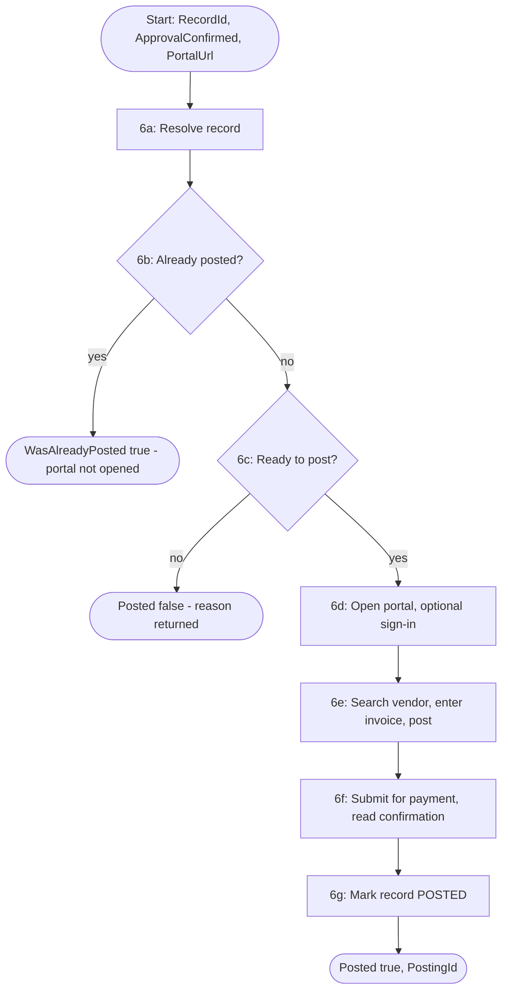

# Solution Design Document — PostToERP_Carlos

> **Template:** RPA Process / Library / Test Automation. Single project (§10 Option B), XAML, Sequence, browser UI automation on serverless.

---

## Document History

| Date | Version | Author | Role | Comments |
|---|---|---|---|---|
| 2026-10-05 | 1.0 | uipath-planner | Generated by AI Agent | Initial SDD generated from `invoice-approval-pdd.md` and its §16 gap analysis |

---

<!-- DO NOT RENAME: uipath-planner detects SDDs via this exact heading or the marker below. -->
<!-- planner-handoff:v1 -->
## Planner Handoff

| Field | Value |
|---|---|
| **Status** | ready |
| **Execution autonomy** | autonomous |
| **Delivery model** | cloud |
| **SDD scope** | solution |
| **Solution root SDD** | invoice-approval-solution-sdd.md |
| **Solution ID** | invoice-approval-solution |
| **Project SDD role** | child |
| **Independently executable** | no — Lane A derives tasks only via the Solution root |
| **Project list section** | §11 |
| **Tasks file** | `implementation-tasks.md` |
| **Generated by** | uipath-planner |
| **Generation date** | 2026-10-05 |
| **Template validation** | passed |

---

## Decisions Made

> Autonomous mode picked the five architectural decisions below without a user checkpoint. Override by rerunning in Interactive mode or by editing the relevant SDD section.

| # | Decision | Picked | One-sentence reason |
|---|---|---|---|
| 1 | **Platform constraints** (Constraint Gate) | cloud; no products blocked | Automation Cloud; serverless robot reaches the hosted portal. |
| 2 | **Scope** (Level 1) | RPA Process inside Solution `invoice-approval-solution` | The ERP posting surface is a web portal UI with no API (PDD §4). |
| 3 | **RPA sub-type** (Level 1.5) | Process | Callable unit with RecordId in/out, started by Maestro. |
| 4 | **Authoring mode** (Level 2) | XAML | Body is mostly browser UI driving plus one entity read and update. |
| 5 | **Framework** | Sequence | One record per job; idempotency and retries are owned by record state and the BPMN. |

---

## Recommended Scope

**Recommendation:** SOLUTION(Maestro BPMN, Agents, RPA Process ×2, Coded Functions, Coded App, IXP, Data Fabric) — this file: RPA Process `PostToERP_Carlos`
**Delivery model:** cloud
**Blocked by platform:** none
**Need profile:** Post every ready invoice to the ERP through the AP portal exactly once, so it is paid and closed without manual entry.

---

## Action Required — SME Review Items

| # | Section | Item | Question | Default applied | Blocking |
|---|---|---|---|---|---|
| 1 | §15 | Portal credential | Move the portal sign-in to an Orchestrator credential asset? | Keep the optional scripted sign-in as built; credential asset recommended before production. | no |
| 2 | §4 BR-04 | Approve unmatched PO (OQ-4) | Can an approved but unmatched invoice be posted? | No (PDD BR-4). | no |
| 3 | §16 | UAT / PROD | Target tenants/folders beyond DEV? | DEV only. | no |

> These items are marked `[SME REVIEW]` in the document. Default-carried items (Blocking = no) do not block task derivation — the automation is built on the recorded defaults, which must be verified before production sign-off. Any Blocking = yes item keeps the handoff at `Status: draft`.

---

## Table of Contents

1. Process Overview
2. Process Map
3. Detailed Process Steps
4. Business Rules
5. Data Definitions
6. Value Mappings
7. Exception Handling
8. Error Handling
9. Application Inventory
10. Master Project Architecture
11. Project Structure
12. Queue Architecture
13. Implementation Mode
14. Packages
15. Credentials & Assets
16. Deployment Environment
17. Testing Strategy
18. Next Steps

---

## 1. Process Overview

| Field | Value |
|---|---|
| **Process name** | `PostToERP_Carlos` |
| **Objective** | PDD step 6: post a ready invoice in the AP portal, submit it for payment, and mark the record POSTED. |
| **Department / Function** | Finance — Accounts Payable posting |
| **Schedule** | On demand: one job per invoice from the BPMN; standalone mode picks the next eligible record. |
| **Volume** | [SME REVIEW] not stated in the PDD |
| **Avg. handling time (manual)** | [SME REVIEW] not stated |
| **Avg. handling time (automated target)** | Under 3 minutes per invoice, plus up to 60 s portal cold start [DEFAULT] |
| **Exception rate** | [SME REVIEW] not stated |
| **Source PDD** | `invoice-approval-pdd.md` §6 Step 6, §8 BR-4/BR-6/BR-7 |

### Delivery Team

| Role | Name | Contact |
|---|---|---|
| SME / Process Owner | Accounts Payable (PDD) | — |

### In Scope

- Resolve the record (exact `RecordId`, or the next eligible in standalone mode).
- Ready-to-post check (PDD BR-4) and already-posted check (BR-6).
- Optional portal sign-in, vendor search, invoice entry, post, submit for payment, read confirmation.
- Update the record: `PostedToERP = True`, `InvoiceLifecycleState = POSTED`.

### Out of Scope

- Bank payment execution after submission (PDD §13).
- Deciding approval (reviewer app) or PO match (functions).

### Assumptions

- The hosted portal URL is passed as `PortalUrl`; no localhost URL appears anywhere in the project, `.objects/` included.
- Portal element ids are stable (`mock-erp/README.md`).
- The BPMN passes `ApprovalConfirmed = true` only after the record reached APPROVED.

---

## 2. Process Map



| Step | Description | Application |
|---|---|---|
| 6a | Resolve record | Data Fabric |
| 6b | Already-posted check | — |
| 6c | Ready-to-post check | — |
| 6d | Open portal, optional sign-in | AP portal (Chrome) |
| 6e | Enter and post invoice | AP portal |
| 6f | Submit for payment, read confirmation id | AP portal |
| 6g | Mark record posted | Data Fabric |

---

## 3. Detailed Process Steps

### Step Summary

| # | Action | Application | Input | Output | Rules | Errors |
|---|---|---|---|---|---|---|
| 6a | Query records (sort only), filter in VB LINQ; `Guid.Parse` the id | Data Fabric | RecordId (blank = standalone) | Record fields | BR-01 | B3, E1 |
| 6b | Check PostedToERP / POSTED | — | Record | WasAlreadyPosted | BR-02 | — |
| 6c | Evaluate ready-to-post | — | Record, ApprovalConfirmed | ReadyToPost, reason | BR-03, BR-04 | B1, B2 |
| 6d | Use Browser on PortalUrl (Simulate); sign-in in Try/Catch with a short timeout | AP portal | PortalUrl | Session | BR-05 | E2 |
| 6e | Vendor search, fill invoice number, PO number, total; Post | AP portal | Record fields | — | BR-06 | E2 |
| 6f | Submit payment; read confirmation id and status | AP portal | — | PostingId | BR-07 | B4, E2 |
| 6g | Update entity (`.Id` set): PostedToERP, InvoiceLifecycleState | Data Fabric | RecordId, PostingId | — | BR-08 | E3 |

### Step Details

#### Step 6c — Ready to post

As built: `ReadyToPost = POMatched AND NOT PostedToERP AND (NOT ApprovalNeeded OR ApprovalConfirmed)`, with unset ApprovalNeeded treated as true. Standalone mode only selects records with POMatched true, ApprovalNeeded false and PostedToERP not true. Any other combination returns `Posted = false` with a reason and never opens the portal.

Target hardening (BR-04): when ApprovalNeeded is true, also require `InvoiceLifecycleState = APPROVED` on the record, so a caller passing ApprovalConfirmed by mistake cannot post a REJECTED or unreviewed invoice [DEFAULT].

#### Step 6f–6g — Partial failure

If the portal confirmed but the record update fails, return `Posted = true` with an ErrorMessage naming the record-update failure, so a re-run does not post twice; ops reconciles the record from PostingId.

---

## 4. Business Rules

| ID | Rule Name | Description | Trigger Condition | Validation (regex / range / type / allowed values) | Affected Steps |
|---|---|---|---|---|---|
| BR-01 | Record id | RecordId is a GUID or blank | Every run | `^[0-9a-fA-F-]{36}$` or empty | 6a |
| BR-02 | No double posting | PDD BR-6 | Record already posted | PostedToERP true OR state POSTED → WasAlreadyPosted | 6b |
| BR-03 | Ready to post | PDD BR-4 (formula in Step 6c) | Not posted | boolean | 6c |
| BR-04 | Approval evidence | Approval-needed invoices require ApprovalConfirmed (as built) and the record state APPROVED (target hardening) | ApprovalNeeded true or unset | ApprovalConfirmed = true; state ∈ `{APPROVED}` | 6c |
| BR-05 | Portal URL | Always the hosted portal from `PortalUrl` | Every run | starts with `https://`; never localhost | 6d |
| BR-06 | Selector portability | Stable element `id` + tag only; window `<html app='chrome.exe' title='Globex AP Portal*' />` | All UI steps | no idx / css / aaname / `role='AX` | 6d–6f |
| BR-07 | Posting id | Confirmation id read from `#confirmation-id` | After submit | non-empty string | 6f |
| BR-08 | Posted state | Set both PostedToERP = True and InvoiceLifecycleState = POSTED | Confirmed | `{POSTED}`; boolean true | 6g |
| BR-09 | Output contract | `Posted`, `WasAlreadyPosted` boolean; `PostingId`, `ErrorMessage` string | Every run | types as stated | all |

---

## 5. Data Definitions

### Option B — XAML Mode

#### Transaction Data (Dictionary)

| Key | Type | Source | Description |
|---|---|---|---|
| RecordId | String (InOut) | Argument / resolved record | Data Fabric record Id |
| ApprovalConfirmed | Boolean | Argument | Reviewer approval confirmed by the BPMN |
| PortalUrl | String | Argument | Hosted AP portal |
| VendorName, InvoiceNumber, PONumber | String | Record | Portal inputs |
| TotalAmountText | String | Record | Portal input; confidential, never logged |

#### Output Data (Dictionary)

| Key | Type | Description |
|---|---|---|
| Posted | Boolean | Portal confirmed the posting |
| WasAlreadyPosted | Boolean | Idempotent return |
| PostingId | String | Portal confirmation id |
| ErrorMessage | String | Reason / failure, without confidential values |

#### Status/Category Values

| Variable | Allowed Values |
|---|---|
| InvoiceLifecycleState (read) | AUTO_APPROVED, APPROVED, POSTED, others → not ready |
| InvoiceLifecycleState (written) | POSTED |

---

## 6. Value Mappings

### Record — to AP portal fields

| Source Value | Target Value |
|---|---|
| `VendorName` | `#input-vendor-name` → select `#vendor-row-*` |
| `InvoiceNumber` | `#input-invoice-number` |
| `PONumber` | `#input-po-number` |
| `TotalAmount` (decimal, invariant culture) | `#input-total-amount` |

---

## 7. Exception Handling

| ID | Exception Name | Trigger Step | Trigger Condition | Action |
|---|---|---|---|---|
| B1 | Not PO matched | 6c | POMatched false | Posted false, reason; portal not opened |
| B2 | Approval missing | 6c | ApprovalNeeded true and not APPROVED / not confirmed | Posted false, reason |
| B3 | Record not found / none eligible | 6a | No record for id; standalone finds none | Posted false, reason |
| B4 | No confirmation | 6f | Confirmation id empty | Posted false, ErrorMessage; record stays unposted (PDD EX-11) |
| B5 | Already posted | 6b | PDD EX-10 | WasAlreadyPosted true; success |

**Default handler:** For any unanticipated business exception, return Posted false with a reason and leave the record unchanged.

---

## 8. Error Handling

| ID | Error Name | Trigger Step | Trigger Condition | Retry Policy | Action |
|---|---|---|---|---|---|
| E1 | Data Fabric read failure | 6a | Query error | 0 (BPMN owns retry) | ErrorMessage; fault |
| E2 | Portal failure | 6d–6f | Element not found, timeout, cold start beyond limit | 0; first request may take 30–60 s (cold start) | Catch: record left unposted, ErrorMessage |
| E3 | Record update failure after posting | 6g | Update error | 0 | Posted true + ErrorMessage; reconcile from PostingId |

**Default handler:** For any unanticipated system error, close the browser, leave the record unposted unless the portal confirmed, and return ErrorMessage.

---

## 9. Application Inventory

| # | Application | Interface | Access Method | Role | Interaction Pattern | Session Management |
|---|---|---|---|---|---|---|
| 1 | Data Fabric `AP_Invoice_Carlos` | API | UiPath.DataService.Activities | SOURCE / TARGET | READ-WRITE | PER_ITEM |
| 2 | AP portal (Globex AP Portal, hosted mock ERP) | WEB | Chrome via UiPath.UIAutomation.Activities, Use Browser URL = `PortalUrl`, InteractionMode Simulate | TARGET | WRITE | PER_ITEM |

### Interactive Authentication / Re-auth Handoff

Not applicable — the portal sign-in is scriptable (optional form `#input-portal-username`, `#input-portal-password`, `#btn-sign-in` in a Try/Catch); no human-only factor.

### Integration Service Connections

| Connector | System | Access Method | Used By |
|---|---|---|---|
| — | AP portal | UI automation (no API) | Steps 6d–6f |

---

## 10. Master Project Architecture

### Option B — Single Project

**Decomposition signals matched:** 0-1 (threshold not met)

> Skip this section. §11 describes a single project. §12 applies only when the project defines or consumes a queue — see §12's include rule.

---

## 11. Project Structure

### Solution / Project Breakdown

| Project | Product (RPA / API / Agent / …) | GitHub Repository | Folder | Attended / Unattended |
|---|---|---|---|---|
| `PostToERP_Carlos` | RPA Process (UI) | `UiPath-Coders/commercial_bootcamp_Carlos` (`lab4-rpa/`) | `Agentic Bootcamp/APAutomation_Carlos` | Unattended (serverless) |

### Reusable Components

| Type (reused / new-reusable) | Name | Details |
|---|---|---|
| reused | `PostToERP_Carlos` 1.0.0 | Published; 2 successful jobs; one invoice POSTED; re-run returned WasAlreadyPosted |
| reused | Object Repository screens (if present) | Hosted portal URL only |

### Project Type

| # | Project Name | Sub-type |
|---|---|---|
| 1 | `PostToERP_Carlos` | Process |

### Project Mode Decision

| # | Project | Type | Compatibility | Authoring | Attendance | Initiation | Framework | Persistence (long-running) | Packaging |
|---|---|---|---|---|---|---|---|---|---|
| 1 | `PostToERP_Carlos` | Process | Cross-platform (Portable, serverless browser) | XAML | Unattended | API (Maestro StartJob) / Manual | Sequence | NO | Solution (.uipx) — linked into `InvoiceApprovalSolution_Carlos` |

### Recommended Structure

#### Sequence layout (for Dispatcher / Reporting / simple projects)

```text
PostToERP_Carlos/
├── project.json
├── Main.xaml
├── ResolveInvoice.xaml
├── PostInvoiceInPortal.xaml
├── MarkInvoicePosted.xaml
└── .entities/EntitiesStore.json
```

### Workflow Inventory

| # | Workflow File | Responsibility | PDD Steps | Inputs | Outputs |
|---|---|---|---|---|---|
| 1 | `Main.xaml` | Contract, already-posted / ready gates, Try/Catch around portal and update | 6 | `RecordId` (InOut String), `ApprovalConfirmed` (Boolean), `PortalUrl` (String) | `Posted`, `WasAlreadyPosted` (Boolean), `PostingId`, `ErrorMessage` (String) |
| 2 | `ResolveInvoice.xaml` | Find the record; ready-to-post evaluation | 6a–6c | `in_RecordId`, `in_ApprovalConfirmed` | `out_RecordId`, `out_ReadyToPost`, `out_AlreadyPosted`, `out_ErrorMessage`, portal field values |
| 3 | `PostInvoiceInPortal.xaml` | Browser session, sign-in, search, entry, post, submit | 6d–6f | `in_PortalUrl`, vendor, invoice number, PO number, total text | `out_PostingId`, `out_PostingStatus`, `out_Submitted` |
| 4 | `MarkInvoicePosted.xaml` | Update record PostedToERP + POSTED | 6g | `in_RecordId`, `in_PostingId` | — |

### UI Element Groups (selector inventory)

| # | Application | Screen | Elements (names) | Capture method |
|---|---|---|---|---|
| 1 | AP portal | Sign-in (optional) | `input-portal-username`, `input-portal-password`, `btn-sign-in` | `uia-configure-target` on the hosted portal |
| 2 | AP portal | Vendor search | `input-vendor-name`, `btn-search`, `vendor-row-*` | `uia-configure-target` |
| 3 | AP portal | Invoice entry | `input-invoice-number`, `input-po-number`, `input-total-amount`, `btn-next-1`, `btn-next-2` | `uia-configure-target` |
| 4 | AP portal | Review / post | `review-po-status`, `btn-post-invoice`, `btn-submit-payment` | `uia-configure-target` |
| 5 | AP portal | Confirmation | `confirmation-id`, `confirmation-status` | `uia-configure-target` |

Fallback when browser capture cannot reach the UiPath extension: `<webctrl id='…' tag='…' />` from `mock-erp/README.md`; never desktop-capture Chrome.

### Workflow Dependencies

```text
Main.xaml
├── calls ResolveInvoice.xaml
├── calls PostInvoiceInPortal.xaml
└── calls MarkInvoicePosted.xaml
```

---

## 12. Queue Architecture

Not applicable — the project defines and consumes no Orchestrator queue (one record per job from the BPMN).

### Queue Definitions

| Queue Name | Producer Project | Consumer Project | Trigger Type | Max Retries |
|---|---|---|---|---|
| — | — | — | — | — |

### Queue Configuration

None — no queue.

### Queue Item Schema

None — no queue.

### Queue Processing Rules

- Not applicable; idempotency is owned by the record state (BR-02) and the BPMN passes the exact RecordId.

---

## 13. Implementation Mode

**Recommendation:** XAML

**Justification (2-3 sentences):** §3 shows steps 6d–6f (the bulk of the work) are browser UI driving with stable element ids; 6a–6c and 6g are one entity read, a boolean expression and one update. No data shaping justifies coded workflows.

> **Note:** This is a preliminary recommendation. Detailed decision criteria will be applied during implementation and may adjust this choice — but the architectural recommendation must already pass the checklist.

---

## 14. Packages

| Package | Version | Purpose |
|---|---|---|
| `UiPath.System.Activities` | 26.8.2 | Control flow, logging |
| `UiPath.DataService.Activities` | 25.9.10 | Entity query / update |
| `UiPath.UIAutomation.Activities` | 26.10.3 | Use Browser, type, click, get text |

---

## 15. Credentials & Assets

| Asset Name | Type | Description | Notes |
|---|---|---|---|
| `PortalUrl` (argument, not an asset) | TEXT | Hosted AP portal URL | Passed by the BPMN |
| Portal sign-in | CREDENTIAL (target) | Optional portal login | `[SME REVIEW]` item 1 — move to an Orchestrator credential asset before production; never in logs or docs |

---

## 16. Deployment Environment

### Robot & Runtime

| Field | Value |
|---|---|
| **Robot type** | UNATTENDED (serverless) |
| **Trigger** | EVENT (Maestro StartJob) / MANUAL |
| **Orchestrator tenant / folder** | Training / `Agentic Bootcamp/APAutomation_Carlos` |
| **UiPath Studio version** | 26.0 |
| **UiPath Robot version** | Serverless runtime (platform-managed) |
| **Orchestrator** | Cloud |
| **Cross-platform / Windows-only** | Cross-platform |
| **Recommended screen resolution** | Serverless default; Simulate interaction does not depend on it |
| **Source repository** | `UiPath-Coders/commercial_bootcamp_Carlos` |
| **Shared libraries referenced** | none |

### Environments (DEV / UAT / PROD)

| Item | DEV | UAT | PROD | Used By |
|---|---|---|---|---|
| Orchestrator + Tenant/Service | staging.uipath.com / Training | [SME REVIEW] | [SME REVIEW] | All |
| Folder | `Agentic Bootcamp/APAutomation_Carlos` | [SME REVIEW] | [SME REVIEW] | All |

### Development & Production Hosts

| Environment | Machine Name(s) / VM Pool | Notes |
|---|---|---|
| Development | Default Serverless (inherited) | Chrome provided by serverless image |
| UAT | [SME REVIEW] | |
| Production | [SME REVIEW] | |

### Runtime Prerequisites

- Network access from serverless to the hosted portal (Render; cold start up to 60 s).
- Chrome on the serverless runtime.
- No localhost URL anywhere in the project (`grep -rl localhost` empty, `.objects/` included).

### Scalability & Concurrency

| Field | Value |
|---|---|
| **Volume** | [SME REVIEW] |
| **Avg handling time (automated)** | ~2–3 minutes [DEFAULT] |
| **Peak window** | [SME REVIEW] |
| **Completion SLA** | [SME REVIEW] (PDD OQ-9) |
| **Exception + retry factor** | 1.0 |
| **Utilization target** | 0.8 [DEFAULT] |
| **Required runtimes** | Serverless, elastic |
| **Concurrent job limit** | Platform serverless limit |
| **Machine template / VM pool** | Default Serverless |
| **Robot accounts** | Agentic Labs Robot (inherited) |
| **Session requirements** | Serverless browser session |
| **Calendars / time zone** | — |
| **Overlapping-job policy** | Allowed; already-posted check prevents duplicates |
| **License assumption** | Serverless runtime [SME REVIEW] |

### Operational Support

| Concern | Design decision |
|---|---|
| **Idempotency** | PostedToERP / POSTED check before opening the portal |
| **Checkpoint & restart** | Re-run with the same RecordId; reconciliation via PostingId |
| **Session recovery** | Browser closed in Catch; record left unposted |
| **Correlation & logging** | RecordId and PostingId; never amounts or tax IDs |
| **Alerting** | BPMN Operational Failure end; faulted jobs |
| **Dashboards** | Orchestrator jobs |
| **Reprocessing** | New BPMN instance or exact-record job |
| **Support ownership** | AP automation team [SME REVIEW] |
| **Business continuity** | Manual posting in the portal, then set the record POSTED |

### Security & Data Handling

| Concern | Design decision |
|---|---|
| **Data classification & PII** | Total amount typed into the portal; never logged |
| **Credentials** | Portal sign-in → credential asset (§15 target) |
| **Service accounts & privilege** | Robot: read/update entity; portal AP user |
| **Encryption** | HTTPS to portal and platform |
| **Retention & audit** | PostingId on the job output; record POSTED |
| **Network** | Outbound HTTPS to the portal host |

### Delivery Quality Gates

| Gate | Decision |
|---|---|
| **Package versioning** | Semver; pinned dependencies (§14) |
| **Workflow Analyzer** | Enforce; contract naming warnings accepted |
| **Source control** | Repo above, branch `main` |
| **CI validation** | `uip rpa build` gate; `grep -c "role='AX"` = 0; `grep -rl localhost` empty |
| **Promotion path** | DEV → [SME REVIEW] |
| **Rollback** | Previous package version retained |
| **Production smoke test** | Exact-record run on an eligible invoice; re-run returns WasAlreadyPosted |

### Non-Functional Requirements

| Dimension | Requirement / Design decision |
|---|---|
| **Security** | See Security & Data Handling above |
| **Performance** | Simulate interaction; short sign-in timeout |
| **Scalability** | See Scalability & Concurrency above |
| **Availability / Resilience** | Idempotent; cold start tolerated |
| **Logging & Monitoring** | RecordId / PostingId correlation |
| **Compliance** | PDD §11 |

---

## 17. Testing Strategy

### Requirements Traceability

| PDD Step / Rule | Covered By (test IDs) |
|---|---|
| Step 6 | T-01, T-02 |
| BR-4 ready to post | T-01, T-02, T-03, T-04 |
| BR-6 no double posting / AC-10 | T-05 |
| AC-9 rejected never posted | T-04 |
| EX-11 posting failure | T-06 |

### Canonical Test Case

| Field | Value |
|---|---|
| RecordId | An eligible record (PO matched, no approval needed, not posted) — not a reserved Lab 10 invoice |
| ApprovalConfirmed | `false` |
| PortalUrl | `https://commercial-bootcamp-mock-erp.onrender.com/portal/` |
| Expected | Posted true; PostingId non-empty; record POSTED and PostedToERP true |

### Happy Path Assertions

1. Portal confirmation id equals the returned PostingId.
2. Record shows PostedToERP = true and InvoiceLifecycleState = POSTED.
3. No other record changed.

### Exception Test Cases

| Exception ID | Test Setup | Trigger | Expected Outcome |
|---|---|---|---|
| B1 | HOLD_PO_MISMATCH record (T-03) | Exact-record run | Posted false; portal not opened |
| B2 | Approval-needed record, not APPROVED (T-04) / REJECTED | Run with ApprovalConfirmed false; after BR-04 hardening also with true | Posted false in both cases |
| B3 | Unknown GUID | Run | Posted false, reason |
| B4 | Portal returns no confirmation (test copy) | Run | Posted false; record unposted |
| B5 | Re-run of a POSTED record (T-05) | Run | WasAlreadyPosted true |
| — | APPROVED record with ApprovalConfirmed true (T-02) | Run | Posted true |

### System Error Scenarios

| Error ID | Testable in Dev? | How to Simulate | Expected Outcome |
|---|---|---|---|
| E1 | NO | Data Fabric outage | Fault; no portal session |
| E2 | YES | Wrong PortalUrl in a test run (T-06) | Catch; record unposted; ErrorMessage |
| E3 | NO | Update failure after confirm | Posted true + ErrorMessage |

### Non-Functional Tests

| Test | Scenario | Expected |
|---|---|---|
| Performance / load | First call after portal idle | Completes despite 30–60 s cold start |
| Concurrent robots | Two jobs, same record | One posting; second WasAlreadyPosted or not ready |
| Recovery / restart | Kill job before submit | Record unposted; re-run posts once |
| Credential expiration | Sign-in form rejects | Clean failure, no lockout loop |
| UI compatibility | Serverless Chrome | Selectors hold on ids; 0 `role='AX` |
| Security | Inspect job logs | 0 amounts or tax IDs |

### UAT Acceptance Criteria

1. 0 rejected invoices posted (PDD AC-9); 0 invoices posted twice (AC-10).
2. 100% of posted invoices satisfied BR-4 at posting time (AC-11).

### Test Data & Cleanup

| Item | Decision |
|---|---|
| **Test data source** | Synthetic lab records |
| **Cleanup** | Posted test records stay POSTED (audit); never reset without user confirmation |

### Production Verification

1. First production postings verified in the portal against PostingId before unattended use.

---

## 18. Next Steps

Load `uipath-planner` with the Solution root:

> Load `uipath-planner`. SDD path: `invoice-approval-solution-sdd.md`.

Lane A writes the shared `implementation-tasks.md`; tasks for this project route to `uipath-rpa` (verify reviewer-approved posting path, credential asset) and `uipath-platform`, ordered before the BPMN.

Implementation tasks **do not live in this SDD** — they live in the planner's output.

### Terminal artefact — packaging per the §11 Project Mode Decision

**Packaging = Solution (`.uipx`)** — the existing process is linked into `InvoiceApprovalSolution_Carlos` with `uip solution deploy config link … --folder-path "Agentic Bootcamp/APAutomation_Carlos"`. Full lifecycle: `uipath-solution` skill.

---

**End of Solution Design Document.**
